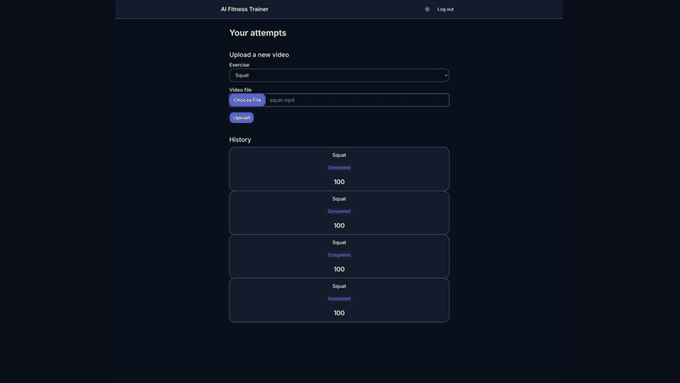

# 🏋️ AI Fitness Trainer

**Upload a video of a squat set → get an objective per-repetition score, form-error
feedback, and an annotated skeleton overlay — the kind of feedback that normally
needs a personal trainer watching in real time.**

| | |
|---|---|
| **Live app** | <https://ai-fitness-trainer-three-rosy.vercel.app> |
| **Live API** | <https://ai-fitness-trainer-api.duckdns.org/health> |
| **Status** | MVP — squat only. Public preview deployment running on a free-tier host (see [Project status](#project-status)). |



*Recorded against the local stack running the real computer-vision service, using the
repository's test fixture ([`backend/tests/fixtures/squat.mp4`](backend/tests/fixtures/squat.mp4)
— a watermarked stock clip kept only for testing).*

---

## What it does

1. **Sign up / sign in** — email + password, JWT access tokens with rotating refresh tokens.
2. **Upload a squat video** (`.mp4` / `.mov`, ≤ 100 MB, ≤ 60 s, H.264). The file is
   validated client-side and re-validated server-side (extension, size, codec, duration).
3. **Automatic analysis** — the video is sent to a computer-vision service that:
   - runs frame-by-frame **pose estimation** (MediaPipe) to extract skeletal keypoints,
   - **segments repetitions** and measures the minimum knee angle of each one,
   - **scores** each rep against a full-depth reference and averages an overall score,
   - flags **form errors** per rep (`insufficient_depth`, `excessive_forward_lean`),
   - renders an **annotated video** with the skeleton and live knee-angle overlay.
4. **Review the result** — overall score, per-rep breakdown, and the annotated video
   (streamed through an authenticated proxy so the CV service's internal key never
   reaches the browser).
5. **History** — every past attempt, with status and score.
6. **Delete** — a GDPR "right to be forgotten" endpoint that erases the attempt from
   the database, file storage, and the CV service in one call.

`knee_valgus` (knee cave-in) is part of the response contract and the UI, but is
deliberately **not** detected: it is a frontal-plane fault, and the pipeline works
from a single side-on camera by design.

---

## Architecture

```
              ┌──────────────┐      HTTPS (JWT)        ┌──────────────┐
   Browser ──▶│  Frontend    │ ─────────────────────▶ │   Backend    │
              │  Next.js 16  │ ◀───────────────────── │   FastAPI    │
              │  (Vercel)    │                        │  PostgreSQL  │
              └──────────────┘                        └──────┬───────┘
                                                             │  internal API key
                                                   multipart │  + HMAC-signed webhook
                                                             ▼
                                                    ┌──────────────────┐
                                                    │   cv-service     │
                                                    │  FastAPI +       │
                                                    │  MediaPipe/OpenCV│
                                                    └──────────────────┘
```

- **`frontend/`** — Next.js 16 (App Router) · React 19 · TypeScript · Tailwind CSS 4 ·
  Base UI · TanStack Query · light/dark themes. Talks to the backend directly; access
  token in memory, refresh token in `localStorage`.
- **`backend/`** — FastAPI · SQLAlchemy (async) · Alembic · PostgreSQL. Owns auth,
  uploads, attempt lifecycle, retention/cleanup jobs, the GDPR delete flow, and the
  authenticated video proxy. Public contract *and* internal CV contract in one service.
- **`cv-service/`** — FastAPI · MediaPipe · OpenCV · NumPy. Stateless analysis worker:
  `POST /v1/jobs` in, HMAC-signed webhook out, annotated video served back. Owned by
  the project's data/AI engineer.
- **`fake-cv-service/`** — a drop-in stand-in for `cv-service` with no ML dependencies.
  Returns a canned result; used in tests and in the current preview deployment.
- **`deploy/`** — production Compose files, Caddy config, backup script, and the
  human-run deployment runbook.
- **`memoria/`** — the academic report for the degree project (in Spanish).

---

## Running locally

Fastest path (Docker):

```bash
# 1. backend + database + a fake CV service
cd backend
cp .env.example .env
docker compose up -d db fake-cv
uv run alembic upgrade head
uv run uvicorn app.main:app --reload           # http://localhost:8000

# 2. frontend
cd ../frontend
npm install
npm run dev                                     # http://localhost:3000
```

To exercise the **real** analysis pipeline instead of the fake one:

```bash
cd backend
docker compose --profile real-cv up -d db cv-service
```

Full details, including the no-Docker path, are in
[`backend/README.md`](backend/README.md), [`frontend/README.md`](frontend/README.md),
and [`cv-service/README.md`](cv-service/README.md).

For a quick test upload, use the repository's own fixture
[`backend/tests/fixtures/squat.mp4`](backend/tests/fixtures/squat.mp4) — a 13-second,
6-rep side-on squat that the real pipeline scores cleanly.

---

## Deployment

Split, free-tier hosting:

- **Frontend** → Vercel.
- **Backend + cv-service + PostgreSQL** → a single always-free ARM VM, reverse-proxied
  by Caddy (automatic Let's Encrypt TLS) behind a DuckDNS subdomain.
- **CI** → pushing to `main` auto-deploys the backend stack over SSH.

The target host is an Oracle Cloud Always-Free Ampere A1 instance. While that capacity
is being waited on, the preview runs on a smaller GCP `e2-micro` instance with the
**fake** CV service — so the live app shows a "scoring is a placeholder" banner. The
computer-vision pipeline shown in the demo above runs for real locally and on the
Oracle target. See [`deploy/README.md`](deploy/README.md).

---

## Team

| Area | Focus |
|------|-------|
| **Data / AI** | Pose estimation, repetition segmentation, scoring and form-error logic (`cv-service/`) |
| **Fullstack** | Web app, frontend, backend, database, infrastructure, deployment (everything else) |

This repository is the fullstack side. `cv-service/` is integrated here but developed
by the data/AI engineer.

---

## Project status

- ✅ Auth, upload, analysis, results, history, GDPR delete — working end to end.
- ✅ Real squat pipeline: rep detection, depth scoring, two of three form errors,
  annotated video.
- ✅ Public preview deployed (frontend + backend + fake CV, placeholder scoring).
- 🚧 Real CV service in production — pending Oracle A1 free-tier capacity.
- 🚧 More exercises (push-ups, pull-ups) — selector is in the UI, marked "coming soon".
