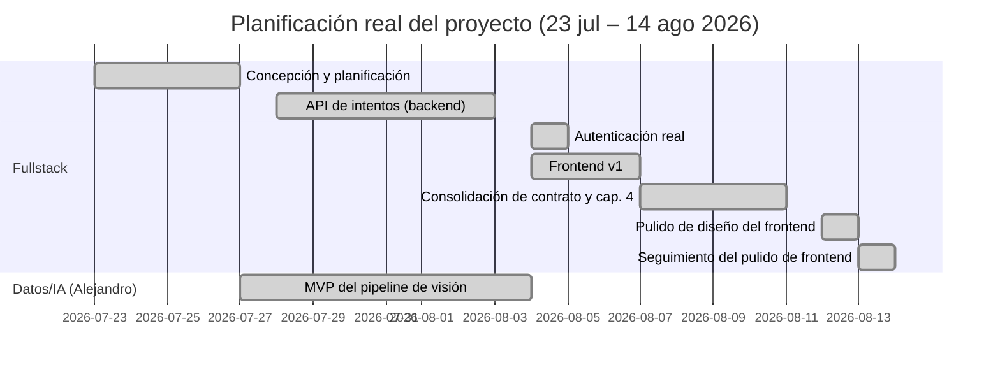

# Memoria Chapter 3 (Planificación) Implementation Plan

> **For agentic workers:** REQUIRED SUB-SKILL: Use superpowers:subagent-driven-development (recommended) or superpowers:executing-plans to implement this plan task-by-task. Steps use checkbox (`- [ ]`) syntax for tracking.

**Goal:** Write `memoria/03-planificacion.md`, the finished Chapter 3 (Planificación) of the
project's academic report — a Mermaid Gantt chart plus phase-by-phase narrative of the project's
real development timeline (2026-07-23 → 2026-08-14), across two parallel tracks — in Spanish.

**Architecture:** This is a writing deliverable, not code. Each task's "test cycle" is a
source-of-truth verification (`git log` against `main` and `origin/cv-pipeline`) *before* writing
the corresponding prose, and a re-check *after*, so every date/commit/PR reference in the chapter
is traceable to real git history rather than assumed from memory. No test suite runs — "passing"
means the written prose matches the verified git data.

**Spec:** `docs/superpowers/specs/2026-08-14-memoria-cap3-planificacion-design.md`

## Global Constraints

- Written entirely in Spanish (per the approved spec, §0).
- Retrospective scope only: 2026-07-23 through 2026-08-14 — no phase or date beyond today (spec
  §0, §4).
- Two tracks: "Fullstack" (this repo's `main` branch) and "Datos/IA (Alejandro)"
  (`origin/cv-pipeline`), syncing at the API contract boundary (spec §1).
- Gantt chart is a Mermaid ` ```mermaid gantt ` block, dates as real commit dates, not estimates
  (spec §2).
- Output file: `memoria/03-planificacion.md` (existing `memoria/` directory, alongside
  `04-requisitos.md`) — `memoria-ada-outline.md` itself is NOT edited (spec §0, §3).
- State the Alejandro-track gap (dense 07-27→08-04, then quiet awaiting his reply) explicitly as a
  planning fact — not smoothed over (spec §1).
- No cost/effort estimates — that's Chapter 8, out of scope here (spec §4).

---

### Task 1: Scaffold the file, write the intro, and add the Gantt chart

**Files:**
- Create: `memoria/03-planificacion.md`

**Interfaces:**
- Consumes: nothing (first task).
- Produces: `memoria/03-planificacion.md` with a `# 3. Planificación` H1, an intro paragraph, and
  a Mermaid Gantt chart. Task 2 appends the phase-by-phase narrative after this content.

- [ ] **Step 1: Verify the phase date ranges against real git history**

Run: `git log main --date=short --pretty=format:'%ad %h %s' --reverse | head -100`
and: `git log origin/cv-pipeline --date=short --pretty=format:'%ad %h %s' 2>/dev/null | sort`

Expected: confirms the 8-phase breakdown below still holds —
phase 1 (concepción) `2026-07-23` → `2026-07-27`; phase 2 (API de intentos) `2026-07-28` →
`2026-08-03`; phase 3 (MVP visión, Alejandro) `2026-07-27` → `2026-08-04`; phase 4 (auth real)
`2026-08-04`; phase 5 (frontend v1) `2026-08-04` → `2026-08-07`; phase 6 (consolidación + cap. 4)
`2026-08-07` → `2026-08-11`; phase 7 (pulido diseño) `2026-08-12`; phase 8 (seguimiento pulido)
`2026-08-13` → `2026-08-14`. If any date has shifted (e.g. new commits landed since this plan was
written), update the Gantt chart's dates in Step 2 before writing it — don't write stale dates.

- [ ] **Step 2: Create the file with the header, intro, and Gantt chart**

Create `memoria/03-planificacion.md`:

```markdown
# 3. Planificación

> Fuente: `docs/superpowers/specs/2026-08-14-memoria-cap3-planificacion-design.md` (diseño
> aprobado). Fechas y fases derivadas directamente del historial de `git log` sobre `main` y
> `origin/cv-pipeline`, no estimadas.

Este proyecto se ha desarrollado en dos pistas paralelas que convergen en el contrato de API
backend↔servicio de visión artificial: la pista **Fullstack** (aplicación web, backend, base de
datos, infraestructura) y la pista **Datos/IA**, a cargo de Alejandro (pipeline de detección de
pose, cálculo de ángulos articulares, scoring). El diagrama y la narrativa que siguen cubren el
periodo real transcurrido hasta la fecha de redacción de este capítulo (14 de agosto de 2026); no
proyectan fases futuras aún sin fechas confirmadas (despliegue en AWS, capítulos restantes de la
memoria, mejoras de precisión del pipeline de visión).


```

- [ ] **Step 3: Verify the file renders as valid Mermaid**

Read the file back and check the fenced block starts with ` ```mermaid ` and ends with ` ``` ` on
its own line, `gantt` is the first line inside the block, and every task line has exactly 4 fields
after the colon (status, id, start, end-or-duration). This catches syntax typos before commit —
Mermaid has no local linter in this repo, so a careful re-read is the verification step.

- [ ] **Step 4: Commit**

```bash
cd "/Volumes/Expansion/Software Builder/Web-App Projects/AI Fitness Trainer"
git add memoria/03-planificacion.md
git commit -m "docs(memoria): draft cap. 3 introducción y diagrama de Gantt"
```

---

### Task 2: Write the phase-by-phase narrative and the Alejandro-dependency note

**Files:**
- Modify: `memoria/03-planificacion.md` (append after Task 1's content)

**Interfaces:**
- Consumes: `memoria/03-planificacion.md` as produced by Task 1 (appends after its last line, i.e.
  after the closing ` ``` ` of the Gantt block).
- Produces: the completed `memoria/03-planificacion.md`, ready for Task 3's final pass.

- [ ] **Step 1: Verify the key commit/PR references for each phase**

Run: `git log main --oneline | grep -E "^(a4708bd|72ac0ed|3c6702f|069b83e|d511efd|fab09b1|39b9e51|667c47d)"`

Expected: all 8 hashes are found (one representative commit per phase — the phase's first or most
defining commit). If any hash is missing (rewritten history), find its replacement via
`git log main --oneline --all | grep "<commit message text>"` and use the new hash in Step 2.

- [ ] **Step 2: Append the phase-by-phase narrative**

Append to `memoria/03-planificacion.md`:

```markdown

## Narrativa por fases

### Fase 1 — Concepción y planificación (23–27 jul 2026)

Arranque del proyecto: commit inicial con la concepción y el esbozo de memoria
(`a4708bd`), seguido de la investigación de mercado y el diseño del contrato de API entre backend
y servicio de visión artificial (`1fa5358`) — el documento que permite a ambas pistas trabajar en
paralelo sin bloquearse mutuamente desde el primer día.

### Fase 2 — API de intentos, backend (28 jul – 3 ago 2026)

Implementación completa de la API de intentos siguiendo un plan TDD de 14 tareas (`72ac0ed`):
modelos de base de datos, autenticación JWT de desarrollo, capa de almacenamiento, validación de
subidas, firma HMAC de webhooks, cliente del servicio de visión, endpoints de creación/consulta/
historial, recepción idempotente del webhook de resultado, reconciliador de sondeo y purga por
retención, además de un servicio de visión simulado (`fake-cv-service`) con un test end-to-end.

### Fase 3 — MVP del pipeline de visión, Alejandro (27 jul – 4 ago 2026)

En paralelo, Alejandro desarrolla el MVP del pipeline de visión en la rama independiente
`cv-pipeline`: detección de pose, cálculo de ángulos articulares por repetición y lógica de
puntuación, expuestos como un servicio FastAPI real (`cv-service`). Injertado en `main` el 4 de
agosto (`3c6702f`), resolviendo los 4 huecos de compatibilidad identificados contra el contrato de
la Fase 1 (prefijo `/v1`, borrado GDPR, autenticación por clave, límites de subida confirmados).

### Fase 4 — Autenticación real (4 ago 2026)

Sustitución del login de desarrollo por autenticación real: registro, login, refresco y cierre de
sesión, con tokens de refresco opacos y hasheados en base de datos y revocación en bloque ante
detección de reuso (`069b83e`).

### Fase 5 — Frontend v1 (4–7 ago 2026)

Construcción completa de la aplicación web (Next.js): flujo de subida de video, sondeo de estado,
visualización de resultado con video anotado, historial de intentos, y páginas de login/registro,
con test end-to-end de Playwright cubriendo el ciclo completo. Fusionado a `main` mediante el PR
#2 (`d511efd`) tras una revisión final que encontró y corrigió 9 hallazgos, incluyendo uno crítico
(la ruta de registro no era alcanzable desde ningún enlace de la interfaz).

### Fase 6 — Consolidación de contrato y memoria Cap. 4 (7–11 ago 2026)

Cierre de huecos de integración entre pistas: documentación del flujo local completo con frontend,
corrección de un bug real de códec de video (`eeae94a` — el video anotado usaba MPEG-4 Part 2,
no reproducible en navegadores) encontrado al probar por primera vez el pipeline real (no el
simulado) desde la interfaz. En paralelo, redacción y fusión del capítulo 4 de esta memoria
(Requisitos) (`fab09b1`).

### Fase 7 — Pulido de diseño del frontend (12 ago 2026)

Primera pasada de diseño visual dedicada sobre el frontend, hasta entonces funcional pero con el
aspecto por defecto de shadcn/ui: nueva paleta de color, cabecera compartida `AppShell`, escala
tipográfica consistente, y rediseño de las tarjetas de resultado e historial (`39b9e51`).

### Fase 8 — Seguimiento del pulido de frontend (13–14 ago 2026)

Cierre de los 5 hallazgos menores diferidos de la revisión final de la Fase 7. Este seguimiento
tuvo un episodio no planeado: automatización de Gas Town (herramienta de orquestación de agentes
en prueba desde el 13 de agosto para el seguimiento de tareas) ejecutó de forma autónoma parte de
este mismo trabajo sin supervisión, requiriendo una reconciliación manual del código antes de
completarse (`667c47d`) — documentado como una lección operativa, no como parte del plan original.

## Dependencia entre pistas: el trabajo pendiente de Alejandro

La pista de Datos/IA es densa entre el 27 de julio y el 4 de agosto (MVP entregado y verificado
end-to-end), pero queda inactiva a partir de esa fecha. El 7 y de nuevo el 11 de agosto se envió a
Alejandro una solicitud para implementar detección de errores de forma (`knee_valgus`,
`insufficient_depth`, `excessive_forward_lean`), aún sin respuesta a 14 de agosto de 2026. Esto
representa una dependencia real entre pistas: una categoría completa de requisitos (ver capítulo 4)
no tiene fecha de entrega comprometida hasta que esa respuesta llegue, y se documenta aquí como tal
en lugar de presentar ambas pistas como si hubieran avanzado de forma continua y simétrica.
```

- [ ] **Step 3: Verify every commit hash cited in the narrative resolves on `main`**

Run: `for h in a4708bd 1fa5358 72ac0ed 3c6702f 069b83e d511efd eeae94a fab09b1 39b9e51 667c47d; do git log main --oneline | grep "^$h" || echo "MISSING: $h"; done`

Expected: every hash prints a matching line, no `MISSING:` output. If any hash is missing, find the
current one (`git log main --oneline --all | grep "<distinctive commit message text>"`) and correct
the citation in Step 2's text before committing.

- [ ] **Step 4: Commit**

```bash
cd "/Volumes/Expansion/Software Builder/Web-App Projects/AI Fitness Trainer"
git add memoria/03-planificacion.md
git commit -m "docs(memoria): draft cap. 3 narrativa por fases y dependencia con Alejandro"
```

---

### Task 3: Final consistency pass

**Files:**
- Modify: `memoria/03-planificacion.md` (fixes only, if any)

**Interfaces:**
- Consumes: the complete `memoria/03-planificacion.md` from Tasks 1-2.
- Produces: final, reviewed `memoria/03-planificacion.md`.

- [ ] **Step 1: Re-read the whole file top to bottom**

Read `memoria/03-planificacion.md` in full and check against the approved spec
(`docs/superpowers/specs/2026-08-14-memoria-cap3-planificacion-design.md`):
- Intro paragraph present, states the two-track framing and the retrospective-only scope.
- Gantt chart present, both `section`s (Fullstack, Datos/IA), all 8 phases, dates match Task 1
  Step 1's verified ranges.
- All 8 phases have a narrative subsection, each citing at least one real commit hash.
- The Alejandro-dependency note is present and explicit (not softened into "ambas pistas avanzan
  en paralelo" or similar).
- Entirely in Spanish — no leftover English scaffolding notes copied in from
  `memoria-ada-outline.md`.
- No date or phase beyond 2026-08-14.
- `memoria-ada-outline.md` itself untouched (`git diff --stat memoria-ada-outline.md` should be
  empty).

- [ ] **Step 2: Fix any drift found in Step 1**

Apply fixes directly to `memoria/03-planificacion.md` if Step 1 found anything (missing phase,
stray English text, an unverified commit hash, a softened dependency note). If nothing is found,
skip to Step 3.

- [ ] **Step 3: Confirm outline file was never modified**

Run: `git diff --stat memoria-ada-outline.md`

Expected: no output (file unchanged).

- [ ] **Step 4: Commit (only if Step 2 made changes)**

```bash
cd "/Volumes/Expansion/Software Builder/Web-App Projects/AI Fitness Trainer"
git add memoria/03-planificacion.md
git commit -m "docs(memoria): fix cap. 3 consistency pass"
```

If Step 2 made no changes, skip this commit — Tasks 1 and 2 already captured the finished chapter.
