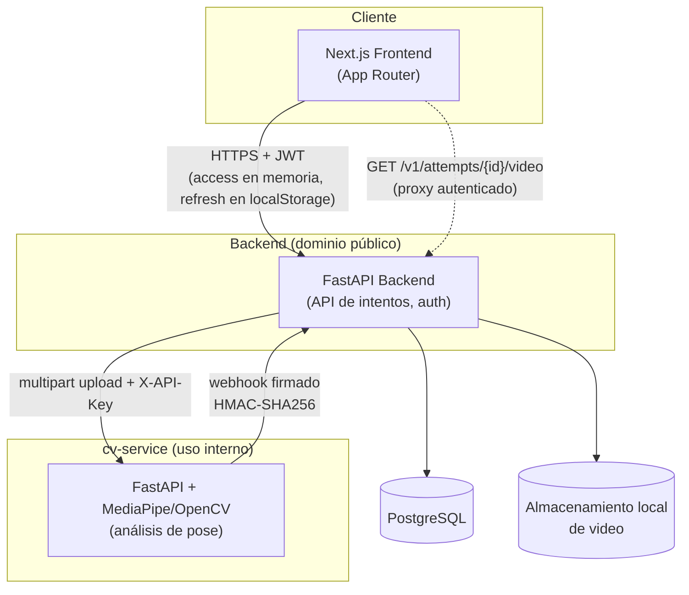
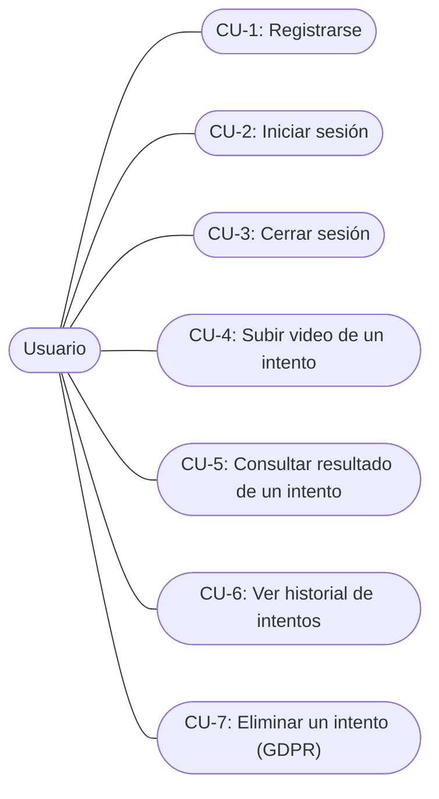
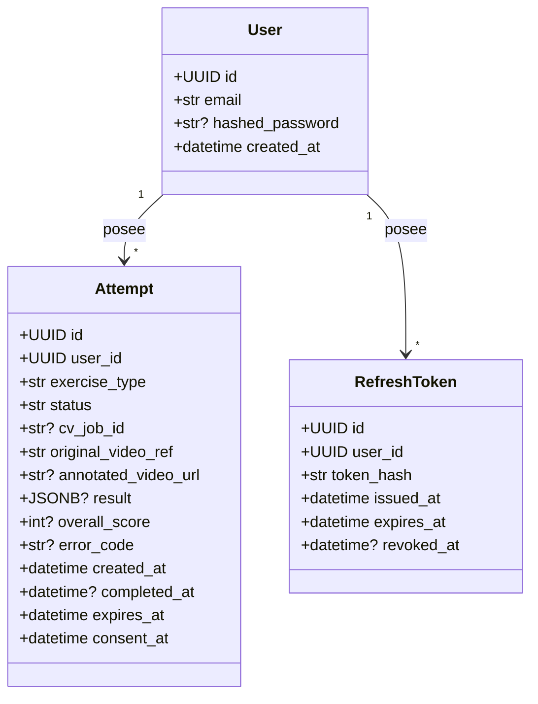

# Memoria Chapter 5 (Diseño) Implementation Plan

> **For agentic workers:** REQUIRED SUB-SKILL: Use superpowers:subagent-driven-development (recommended) or superpowers:executing-plans to implement this plan task-by-task. Steps use checkbox (`- [ ]`) syntax for tracking.

**Goal:** Write `memoria/05-diseno.md`, the finished Chapter 5 (Diseño) of the project's academic
report — architecture, use-case diagram, class design, UI design (with real screenshots), and
data-persistence design — in Spanish.

**Architecture:** This is a writing deliverable, not code. Each task's "test cycle" is a
source-of-truth verification (grep/read the actual backend/frontend/cv-service code, or capture a
real screenshot of the actually-running app) *before* writing the corresponding prose/diagram, and
a re-check *after*, so every factual claim and every diagram edge is traceable to something real
rather than assumed from memory or invented. No automated test suite runs — "passing" means the
written content matches the verified fact or the captured screen.

**Tech Stack:** Markdown + Mermaid diagrams (rendered natively by GitHub and most Markdown
viewers). PNG screenshots for Section 4, captured via browser automation against the app running
locally. No code changes to `backend/`, `frontend/`, or `cv-service/`.

**Spec:** `docs/superpowers/specs/2026-08-24-memoria-cap5-diseno-design.md`

## Global Constraints

- Written entirely in Spanish (spec §0).
- Grounded in the real shipped system, not the outline's speculative stack (no Redis, no PyTorch,
  no Express) (spec §0).
- Output file: `memoria/05-diseno.md` (new) — `memoria-ada-outline.md` itself is NOT edited (spec
  §0).
- Deployment topology (Vercel/Oracle VM/Caddy) is out of scope — mentioned only as a one-line
  pointer to `deploy/README.md` (spec §0).
- All diagrams are Mermaid, embedded directly in the Markdown (spec §1-3).
- Section 4 uses real screenshots of the actually-running app, not wireframes (spec §4).
- Section 3's class diagram covers only the real SQLAlchemy models (`User`, `Attempt`,
  `RefreshToken`) — not the outline's imagined `Exercise`/`Score`/`Feedback`/`VideoAsset` (spec §3).

---

### Task 1: Verify architecture facts and write Section 1 (Arquitectura)

**Files:**
- Create: `memoria/05-diseno.md`

**Interfaces:**
- Consumes: nothing (first task).
- Produces: `memoria/05-diseno.md` with a `# 5. Diseño` H1, a provenance blockquote, and
  `## Arquitectura` H2. Task 2 appends a sibling `## Diagramas de uso` H2 after this content.

- [ ] **Step 1: Verify the video-proxy route and webhook-signing scheme still exist as described**

Run: `grep -n "GET.*video\|X-CV-Signature\|X-CV-Timestamp" backend/app/api/attempts.py backend/app/security/signing.py`

Expected output includes: a `GET "/{attempt_id}/video"` route in `attempts.py` (around line 183)
and `X-CV-Signature`/`X-CV-Timestamp` header names in `signing.py`. If the route or header names
differ, use the actual current names in Step 3 below instead of the ones shown here.

- [ ] **Step 2: Verify the frontend has no BFF layer (browser calls the backend directly)**

Run: `grep -rn "NEXT_PUBLIC_API_BASE_URL" frontend/src/lib/api-client.ts`

Expected: the constant reads `process.env.NEXT_PUBLIC_API_BASE_URL`, confirming the browser talks
to the backend's real base URL directly, not through a Next.js API route acting as a proxy.

- [ ] **Step 3: Create the file with the architecture section**

Create `memoria/05-diseno.md`:

```markdown
# 5. Diseño

> Fuente: `docs/superpowers/specs/2026-08-24-memoria-cap5-diseno-design.md` (diseño aprobado).
> Arquitectura y componentes descritos según el sistema realmente implementado, no según la
> propuesta original de `memoria-ada-outline.md` §5 (que mencionaba Redis, PyTorch y Express —
> ninguno de los tres existe en el sistema real).

## Arquitectura



El frontend llama al backend directamente desde el navegador — no existe una capa BFF
(*Backend-for-Frontend*) intermedia en Next.js; el token de acceso vive en memoria y el de
refresco en `localStorage` (`frontend/src/lib/api-client.ts`).

**Video anotado: proxy autenticado, nunca acceso directo.** La URL del video anotado que produce
cv-service nunca llega al navegador tal cual. El backend la reescribe a
`GET /v1/attempts/{attempt_id}/video` (`backend/app/api/attempts.py`), una ruta protegida por JWT
que descarga el video de cv-service usando la clave interna (`X-API-Key`) del backend y la
retransmite al usuario. Esta indirección existe por una razón concreta: la clave interna de
cv-service no debe llegar jamás al navegador de un usuario — si la URL original se expusiera
directamente, cualquiera con ella podría usarla para llamar a cv-service sin autenticarse como
usuario del sistema.

**Comunicación backend ↔ cv-service firmada.** Cada webhook que cv-service envía al backend al
terminar un análisis va firmado con HMAC-SHA256 sobre `timestamp + "." + body`
(`backend/app/security/signing.py`), con la firma y el timestamp en las cabeceras
`X-CV-Signature`/`X-CV-Timestamp`. El backend rechaza cualquier webhook cuya firma no coincida,
evitando que un tercero pueda falsificar el resultado de un análisis.
```

- [ ] **Step 4: Verify the written section against Steps 1-2's output**

Re-read the `## Arquitectura` section just written and confirm the route path, header names, and
`NEXT_PUBLIC_API_BASE_URL` reference match Steps 1-2's actual grep output exactly. Fix any drift
before committing.

- [ ] **Step 5: Commit**

```bash
git add memoria/05-diseno.md
git commit -m "docs(memoria): draft cap. 5 arquitectura"
```

---

### Task 2: Verify use cases and write Section 2 (Diagramas de uso)

**Files:**
- Modify: `memoria/05-diseno.md` (append after Task 1's content)

**Interfaces:**
- Consumes: `memoria/05-diseno.md` as produced by Task 1 (appends after its last line).
- Produces: `memoria/05-diseno.md` with a `## Diagramas de uso` H2 added. Task 3 appends a sibling
  `## Diseño de clases` H2 after this content.

- [ ] **Step 1: Verify Chapter 4's 7 use cases still match the current routes**

Run: `grep -n "^### CU-" memoria/04-requisitos.md`

Expected output (7 lines): `CU-1: Registrarse`, `CU-2: Iniciar sesión`, `CU-3: Cerrar sesión`,
`CU-4: Subir video de un intento`, `CU-5: Consultar resultado de un intento`, `CU-6: Ver historial
de intentos`, `CU-7: Eliminar un intento (derecho al olvido / GDPR)`. This diagram must use exactly
these 7 — no new use cases, no dropped ones. If Chapter 4 has since changed, use its current
wording verbatim.

- [ ] **Step 2: Append the use-case diagram**

Append to `memoria/05-diseno.md`:

```markdown

## Diagramas de uso

Diagrama de casos de uso derivado directamente de los 7 casos de uso funcionales del Capítulo 4
(`memoria/04-requisitos.md`) — Mermaid no tiene una notación UML de casos de uso nativa, por lo que
se usa un `flowchart` con el actor conectado a cada caso de uso, la alternativa habitual.



No existe ningún actor adicional (no hay rol de administrador en el sistema real) ni ningún caso de
uso fuera de estos 7 — este diagrama visualiza los requisitos del Capítulo 4, no añade alcance
nuevo.
```

- [ ] **Step 3: Verify the diagram's 7 nodes match Step 1's grep output**

Re-read the appended `flowchart` and confirm each `CU1`..`CU7` label matches Step 1's output
verbatim (same numbering, same Spanish wording). Fix any mismatch before committing.

- [ ] **Step 4: Commit**

```bash
git add memoria/05-diseno.md
git commit -m "docs(memoria): draft cap. 5 diagrama de casos de uso"
```

---

### Task 3: Verify model fields and write Section 3 (Diseño de clases)

**Files:**
- Modify: `memoria/05-diseno.md` (append after Task 2's content)

**Interfaces:**
- Consumes: `memoria/05-diseno.md` as produced by Task 2 (appends after its last line).
- Produces: `memoria/05-diseno.md` with a `## Diseño de clases` H2 added. Task 4 appends a sibling
  `## Diseño de interfaz` H2 after this content.

- [ ] **Step 1: Verify the 3 real SQLAlchemy models and their fields**

Run: `grep -n "Mapped\[" backend/app/models/user.py backend/app/models/attempt.py backend/app/models/refresh_token.py`

Expected: `User` has `id`, `email`, `hashed_password` (nullable), `created_at`; `Attempt` has `id`,
`user_id`, `exercise_type`, `status`, `cv_job_id` (nullable), `original_video_ref`,
`annotated_video_url` (nullable), `result` (JSONB, nullable), `overall_score` (nullable),
`error_code` (nullable), `created_at`, `completed_at` (nullable), `expires_at`, `consent_at`;
`RefreshToken` has `id`, `user_id`, `token_hash`, `issued_at`, `expires_at`, `revoked_at`
(nullable). If any field was added/removed/renamed, use the actual current fields in Step 2 below.

- [ ] **Step 2: Append the class diagram**

Append to `memoria/05-diseno.md`:

```markdown

## Diseño de clases



*(El sufijo `?` marca un campo nullable en la base de datos.)*

Estos son los 3 únicos modelos ORM reales (`backend/app/models/`). La propuesta original de
`memoria-ada-outline.md` §5 imaginaba clases separadas `Exercise`, `Score`, `Feedback/Tip` y
`VideoAsset` — ninguna existe como tabla o clase independiente en el sistema real. El score por
repetición, los códigos de error (`knee_valgus`/`insufficient_depth`/`excessive_forward_lean`) y
los consejos de mejora viven como **JSON anidado dentro de `Attempt.result`**, con la forma que
define el contrato de respuesta de cv-service — no como filas o clases propias. `exercise_type` es
un campo de texto plano, no una entidad `Exercise` normalizada, ya que hoy solo existe un ejercicio
soportado (sentadilla). Esta es una simplificación deliberada del sistema real, no una omisión de
este diagrama.
```

- [ ] **Step 3: Verify the diagram's fields against Step 1's grep output**

Re-read the appended `classDiagram` and confirm every field name, nullability marker, and type
matches Step 1's actual grep output. Fix any drift before committing.

- [ ] **Step 4: Commit**

```bash
git add memoria/05-diseno.md
git commit -m "docs(memoria): draft cap. 5 diseño de clases"
```

---

### Task 4: Capture real screenshots and write Section 4 (Diseño de interfaz)

**Files:**
- Create: `memoria/figuras/05-01-login.png`
- Create: `memoria/figuras/05-02-registro.png`
- Create: `memoria/figuras/05-03-subida.png`
- Create: `memoria/figuras/05-04-resultado.png`
- Create: `memoria/figuras/05-05-historial.png`
- Modify: `memoria/05-diseno.md` (append after Task 3's content)

**Interfaces:**
- Consumes: `memoria/05-diseno.md` as produced by Task 3 (appends after its last line); the app
  running locally per `backend/README.md`'s "Run the whole loop locally" section.
- Produces: `memoria/05-diseno.md` with a `## Diseño de interfaz` H2 added, referencing the 5 PNG
  figures above. Task 5 appends a sibling `## Diseño de persistencia de datos` H2 after this
  content.

- [ ] **Step 1: Start the full local loop with the real cv-service (not fake-cv)**

The production backend doesn't exist yet (Oracle VM still pending, see
`docs/superpowers/specs/2026-08-14-free-tier-deployment-design.md`), so screenshots must come from
a local run. Real `cv-service` is needed (not `fake-cv-service`, which always returns a canned
502-ing URL) so the result screen shows a genuine score and rep breakdown:

```bash
cd backend
docker compose --profile real-cv up -d db cv-service
BACKEND_PUBLIC_URL=http://host.docker.internal:8000 uv run uvicorn app.main:app --reload
```

In a second terminal:

```bash
cd frontend
npm run dev
```

Confirm all three are up: `curl -s localhost:8000/health` returns `{"status":"ok"}`; `curl -s
localhost:9000/health` (or the real cv-service's health path — check its README if this 404s)
returns healthy; `http://localhost:3000` loads in a browser.

- [ ] **Step 2: Capture the register and login screens**

Using browser automation (load the `claude-in-chrome` tools via `ToolSearch` if not already
loaded), open a new tab to `http://localhost:3000/register`. Take a full-page screenshot and save
it to `memoria/figuras/05-02-registro.png`. Register a throwaway account (e.g.
`memoria-cap5@example.com` / a password meeting the real validation rule — check
`frontend/src/app/register/page.tsx` or the backend's password-strength check if the exact rule
isn't already known). After registering, log out (via the `AppShell` logout control), navigate to
`http://localhost:3000/login`, take a full-page screenshot, save it to
`memoria/figuras/05-01-login.png`, then log back in.

- [ ] **Step 3: Capture the upload screen**

From the authenticated home page (`http://localhost:3000/`), take a full-page screenshot of the
upload form before submitting anything. Save it to `memoria/figuras/05-03-subida.png`.

- [ ] **Step 4: Upload a real video and capture the result screen**

Submit `backend/tests/fixtures/squat.mp4` through the upload form with `exercise_type=squat`. Wait
for the attempt to reach `completed` status (the real `cv-service` takes longer than
`fake-cv-service`'s ~5s canned delay — poll the UI or wait up to ~60s; if it's still `processing`,
wait longer rather than screenshotting an incomplete state). Once completed, on the attempt-detail
page (`/attempts/[id]`), take a full-page screenshot showing the score card, the annotated video
player, and the per-rep breakdown. Save it to `memoria/figuras/05-04-resultado.png`.

- [ ] **Step 5: Capture the history screen**

Navigate to `http://localhost:3000/attempts` (the history list). Take a full-page screenshot
showing at least the one real attempt just created, with its status pill. Save it to
`memoria/figuras/05-05-historial.png`.

- [ ] **Step 6: Verify all 5 files exist and are non-trivial images**

Run: `ls -la memoria/figuras/*.png && file memoria/figuras/*.png`

Expected: 5 files, each `file` output confirming a real PNG image (not a 0-byte or corrupt file).
If any capture failed or shows an error/loading state instead of the intended screen, redo that
step before continuing.

- [ ] **Step 7: Append the UI design section**

Append to `memoria/05-diseno.md`:

```markdown

## Diseño de interfaz

A diferencia del resto de este capítulo, esta sección no usa wireframes sino **capturas reales de
las pantallas ya implementadas**, obtenidas ejecutando la aplicación en local (el backend de
producción todavía no existe — VM de Oracle pendiente, ver
`docs/superpowers/specs/2026-08-14-free-tier-deployment-design.md`).

### Inicio de sesión (CU-2)


Formulario de email y contraseña. Un fallo de autenticación se comunica como "Invalid email or
password" — un mensaje deliberadamente distinguible de un error de red o de servidor (ver
`frontend/src/lib/auth-provider.tsx` o equivalente).

### Registro (CU-1)


Formulario de alta de cuenta. Al completarse, el backend crea la cuenta y devuelve de inmediato un
par de tokens (access + refresh) — el usuario queda autenticado sin pasar por login.

### Subida de video (CU-4)


Formulario de subida en la página de inicio autenticada. Valida extensión (`.mp4`/`.mov`), tamaño
(≤100MB) y duración (≤60s) antes de enviar el video al backend.

### Resultado de un intento (CU-5)


Muestra el score global, el video anotado (reproducido mediante un *blob URL* obtenido vía
`fetch` autenticado — nunca un `<video src>` directo, ya que eso no envía la cabecera de
autorización) y el desglose por repetición, incluyendo los códigos de error detectados
(`knee_valgus`/`insufficient_depth`/`excessive_forward_lean`) cuando aplican.

### Historial de intentos (CU-6)


Lista paginada de intentos propios, ordenada por fecha, con una píldora de estado por intento
(pendiente/procesando/completado/fallido).
```

- [ ] **Step 8: Verify the section's image references resolve**

Run: `grep -oE '\(figuras/[^)]+\)' memoria/05-diseno.md`

Expected: exactly the 5 paths from Step 6, each with a leading `figuras/` (relative to
`memoria/05-diseno.md`'s own directory). Confirm each referenced file actually exists under
`memoria/figuras/`.

- [ ] **Step 9: Commit**

```bash
git add memoria/05-diseno.md memoria/figuras/
git commit -m "docs(memoria): draft cap. 5 diseño de interfaz (capturas reales)"
```

- [ ] **Step 10: Stop the local loop cleanly**

```bash
cd backend && docker compose down
```

Stop the `uv run uvicorn` and `npm run dev` processes (Ctrl-C in their terminals, or kill by PID if
run in the background). Leaving them running is harmless but unnecessary once captures are done.

---

### Task 5: Verify persistence facts and write Section 5 (Diseño de persistencia de datos)

**Files:**
- Modify: `memoria/05-diseno.md` (append after Task 4's content)

**Interfaces:**
- Consumes: `memoria/05-diseno.md` as produced by Task 4 (appends after its last line).
- Produces: `memoria/05-diseno.md` with a `## Diseño de persistencia de datos` H2 added. Task 6
  performs the final consistency pass over the whole file.

- [ ] **Step 1: Verify the current Alembic migration head**

Run: `ls backend/alembic/versions/*.py`

Expected: `0001_initial.py` and `0002_auth.py` (head is `0002`). If more migrations exist now, use
the actual latest revision file/id in Step 4 below instead of `0002`.

- [ ] **Step 2: Verify the GDPR erasure ordering**

Run: `grep -n "def delete_attempt" -A 20 backend/app/services/attempts.py`

Expected order, exactly: (1) `storage.delete(attempt.original_video_ref)` — local video file
deleted first; (2) `if attempt.cv_job_id: await cv_client.delete_job(...)` — cv-service job erasure
second; (3) `await db.delete(attempt)` then `await db.commit()` — DB row deleted last. This order
matters: if the cv-service call raises, the exception propagates *before* the row is deleted, so a
failed erasure never gets falsely reported as successful. (Chapter 4's own review once caught this
exact step order stated backwards — verify Step 4 below states it correctly, matching this grep
output, not that earlier mistake.)

- [ ] **Step 3: Verify retention and storage facts**

Run: `grep -n "expires_at\|retention\|purge" backend/app/main.py backend/app/services/attempts.py | head -20`
and `grep -n "^class" backend/app/services/storage.py`

Expected: a background "purge" job referencing `expires_at`/30-day retention (per
`backend/README.md`'s "Background jobs" section), and `storage.py` defining a `Storage` protocol
with `LocalFilesystemStorage` as its one real implementation (no S3/MinIO class).

- [ ] **Step 4: Append the data-persistence section**

Append to `memoria/05-diseno.md`:

```markdown

## Diseño de persistencia de datos

**Gestión del esquema:** migraciones Alembic (`backend/alembic/versions/`), cabeza actual en la
revisión `0002` (`0002_auth.py`, tras `0001_initial.py`) — 4 tablas reales en total (los 3 modelos
de la sección anterior más la tabla interna de control de versiones de Alembic).

**Diseño de borrado (GDPR, CU-7):** `delete_attempt`
(`backend/app/services/attempts.py`) sigue un orden deliberado, no incidental:

1. Se borra primero el archivo de video local (`storage.delete(...)`).
2. Se solicita después a cv-service el borrado del job y sus archivos, si existe uno asociado.
3. Se borra la fila de la base de datos en último lugar, y solo entonces se confirma la
   transacción.

Este orden garantiza que, si la llamada a cv-service falla, la excepción se propaga *antes* de
borrar la fila — el intento sobrevive y el usuario puede reintentar el borrado, en vez de que la
aplicación reporte falsamente un borrado GDPR que en realidad no se completó del todo.

**Retención:** cada `Attempt` tiene un campo `expires_at`; una tarea en segundo plano ("purge",
cada 6h) borra automáticamente los intentos que superan su fecha de expiración (30 días desde la
subida) mediante la misma ruta de borrado que CU-7.

**Almacenamiento de video:** disco local, detrás de una interfaz `Storage`
(`backend/app/services/storage.py`) con una única implementación real, `LocalFilesystemStorage` —
deliberadamente no S3 ni ningún almacenamiento en la nube, en línea con la restricción de
despliegue gratuito del proyecto.
```

- [ ] **Step 5: Verify every claim against Steps 1-3's output**

Re-read the appended section and cross-check the Alembic revision id, the 3-step erasure order,
the retention window, and the storage class name against Steps 1-3's actual output. Fix any drift
before committing.

- [ ] **Step 6: Commit**

```bash
git add memoria/05-diseno.md
git commit -m "docs(memoria): draft cap. 5 diseño de persistencia de datos"
```

---

### Task 6: Final consistency pass

**Files:**
- Modify: `memoria/05-diseno.md` (fixes only, if any)

**Interfaces:**
- Consumes: the complete `memoria/05-diseno.md` from Tasks 1-5.
- Produces: final, reviewed `memoria/05-diseno.md`.

- [ ] **Step 1: Re-read the whole file top to bottom**

Read `memoria/05-diseno.md` in full and check against the approved spec
(`docs/superpowers/specs/2026-08-24-memoria-cap5-diseno-design.md`):
- All 5 sections present in order: Arquitectura, Diagramas de uso, Diseño de clases, Diseño de
  interfaz, Diseño de persistencia de datos.
- Every Mermaid code block opens with ` ```mermaid ` and closes with ` ``` ` correctly nested
  inside the outer Markdown (no stray fence breaking the rest of the file — Chapter 3's Task 1 hit
  exactly this bug once).
- Entirely in Spanish — no leftover English scaffolding notes copied in from
  `memoria-ada-outline.md`.
- No mention of Redis, PyTorch, or Express anywhere (the corrected-vs-outline constraint).
- All 5 image references in `## Diseño de interfaz` resolve to real files under
  `memoria/figuras/`.
- `memoria-ada-outline.md` itself untouched.

- [ ] **Step 2: Fix any drift found in Step 1**

Apply fixes directly to `memoria/05-diseno.md` if Step 1 found anything (missing section, broken
fence, stray English text, a dangling image reference). If nothing is found, skip to Step 3.

- [ ] **Step 3: Confirm outline file was never modified**

Run: `git diff --stat memoria-ada-outline.md`

Expected: no output (file unchanged).

- [ ] **Step 4: Confirm all 5 figures are tracked in git**

Run: `git status --short memoria/figuras/`

Expected: no output (all 5 PNGs already committed in Task 4, nothing untracked left behind).

- [ ] **Step 5: Commit (only if Step 2 made changes)**

```bash
git add memoria/05-diseno.md
git commit -m "docs(memoria): fix cap. 5 consistency pass"
```

If Step 2 made no changes, skip this commit — Tasks 1-5 already captured the finished chapter.
