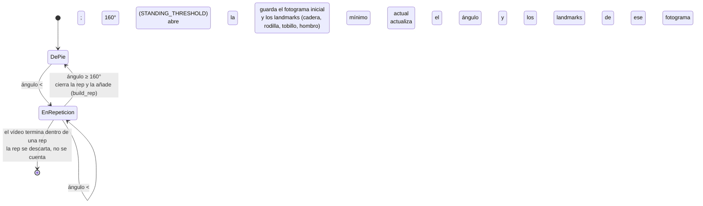

# Memoria Chapter 6 (Implementación) Implementation Plan

> **For agentic workers:** REQUIRED SUB-SKILL: Use superpowers:subagent-driven-development (recommended) or superpowers:executing-plans to implement this plan task-by-task. Steps use checkbox (`- [ ]`) syntax for tracking.

**Goal:** Write `memoria/06-implementacion.md`, the finished Chapter 6 (Implementación) of the
project's academic report — the movement-analysis algorithm, the inter-service integration, the
technology decisions (including deliberate omissions), and the packaging/deployment shape — in
Spanish, grounded in the real source code.

**Architecture:** This is a writing deliverable, not code. Each task's "test cycle" is a
source-of-truth verification (`grep`/`read` the actual `cv-service/` or `backend/` or `frontend/`
source) *before* writing the corresponding prose/diagram, and a re-check *after*, so every constant,
threshold, function name, route and formula is traceable to something real rather than remembered or
invented. No automated test suite runs — "passing" means the written content matches the verified
fact.

**Tech Stack:** Markdown + Mermaid (one `stateDiagram-v2`, rendered natively by GitHub) + LaTeX
display math (two blocks). No code changes to `backend/`, `frontend/`, or `cv-service/`.

**Spec:** `docs/superpowers/specs/2026-08-28-memoria-cap6-implementacion-design.md`

## Global Constraints

- Written entirely in Spanish (spec §0).
- Output file: `memoria/06-implementacion.md` (new), `NN-nombre.md` pattern — `memoria-ada-outline.md`
  itself is NOT edited (spec §0).
- **No source-code blocks anywhere** — the outline is explicit that the code itself is out of scope;
  this chapter describes technology and algorithms, not code (spec §0, §3).
- Grounded in the real shipped system, correcting the pre-code outline where they disagree: **no
  trained model** (MediaPipe Pose off-the-shelf + deterministic rules), **FastAPI for both
  services** (not "FastAPI vs Express"), **static tip lookup** (not NLG), **free-tier split hosting**
  (not "AWS services") (spec §0).
- Deployment *mechanics* (provisioning, CI/CD, DuckDNS cron, backup job, live-verification
  checklist) are **§12 Anexos**, not this chapter — §6.2.3 states only the shape and the
  "must be free" constraint in ~1 paragraph, pointing to §12 (spec §0, §2.3).
- §5's material (architecture diagram, video-proxy design rationale, HMAC design rationale, class
  model, persistence/erasure design) is **cross-referenced, not repeated** (spec §4).
- Diagrams: exactly **1** Mermaid `stateDiagram-v2` (rep segmentation), **2** display-math blocks
  (knee angle, score curve), **1** small table (CV constants). No architecture diagram (spec §3).
- The CV pipeline (§6.1) is Alejandro's work (Datos/IA track), integrated into this repo — the prose
  says so plainly. A §6.1 review-request message for Alejandro is drafted **after merge** (Task 7),
  and is **not a merge blocker** (spec §2, §5).

---

### Task 1: Verify pose/angle facts and write §6.1.1–§6.1.2

**Files:**
- Create: `memoria/06-implementacion.md`

**Interfaces:**
- Consumes: nothing (first task).
- Produces: `memoria/06-implementacion.md` with a `# 6. Implementación` H1, a provenance
  blockquote, `## 6.1 Pipeline de análisis de movimiento (cv-service)` H2, an attribution
  paragraph, and `### 6.1.1 Extracción de pose` + `### 6.1.2 Ángulo de rodilla` subsections. Task 2
  appends `### 6.1.3` after this content.

- [ ] **Step 1: Verify the MediaPipe setup and the four landmarks**

Run: `grep -n "mp_pose\|min_detection_confidence\|min_tracking_confidence\|RIGHT_HIP\|RIGHT_KNEE\|RIGHT_ANKLE\|RIGHT_SHOULDER\|COLOR_BGR2RGB\|pose.process\|NoPoseDetectedError\|mediapipe==" cv-service/pipeline.py cv-service/requirements.txt`

Expected: one `mp_pose.Pose(min_detection_confidence=0.5, min_tracking_confidence=0.5)`; a
`cv2.cvtColor(frame, cv2.COLOR_BGR2RGB)` then `pose.process(...)`; exactly the four right-side
landmarks `RIGHT_HIP`/`RIGHT_KNEE`/`RIGHT_ANKLE`/`RIGHT_SHOULDER`, each multiplied by `width`/
`height` to de-normalise to pixels; `NoPoseDetectedError` raised when `detections` is empty;
`mediapipe==0.10.14` in `requirements.txt`. If the pinned MediaPipe version differs, use the actual
one in Step 3.

- [ ] **Step 2: Verify the knee-angle and torso-lean helpers**

Run: `grep -n "def calculate_angle\|def torso_lean_from_vertical\|np.clip\|np.arccos\|np.dot\|degrees\|vertical_point\|calculate_angle(shoulder, hip" cv-service/pipeline.py`

Expected: `calculate_angle(a, b, c)` computes the vertex angle at `b` from the dot product of
`b→a` and `b→c` over the product of their norms, `np.clip(..., -1.0, 1.0)` before `np.arccos`,
result in degrees; `torso_lean_from_vertical(hip, shoulder)` now delegates to
`calculate_angle(shoulder, hip, [hip[0], hip[1] - 1])` (a synthetic point directly above the hip)
rather than re-implementing the math. If the clip bounds or the synthetic-point construction
differ, use the actual code in Step 3.

- [ ] **Step 3: Create the file with the header and §6.1.1–§6.1.2**

Create `memoria/06-implementacion.md`:

```markdown
# 6. Implementación

> Fuente: `docs/superpowers/specs/2026-08-28-memoria-cap6-implementacion-design.md` (diseño
> aprobado). Este capítulo describe **tecnologías y algoritmos**, no el código en sí (según la
> estructura de `memoria-ada-outline.md` §6). Los detalles del despliegue —aprovisionamiento de la
> máquina, CI/CD, verificación en producción— están en el §12 (Anexos), no aquí. La arquitectura,
> el diseño de clases y el diseño de persistencia se describen en el §5 y aquí solo se referencian.

## 6.1 Pipeline de análisis de movimiento (cv-service)

El análisis de la sentadilla lo desarrolla Alejandro (línea de Datos/IA) y está integrado en este
mismo repositorio como el servicio `cv-service`. El código vive en `cv-service/pipeline.py` y sus
constantes están documentadas en `cv-service/GLOSARIO.md`. Esta sección lo describe en detalle
técnico a partir de ese código.

### 6.1.1 Extracción de pose

La detección de pose usa **MediaPipe Pose** (`mp.solutions.pose`, `mediapipe==0.10.14`), un
detector **pre-entrenado y usado tal cual** —no se entrena ningún modelo propio—. Se crea una única
instancia `Pose` por trabajo, con `min_detection_confidence=0.5` y `min_tracking_confidence=0.5`.

Por cada fotograma: OpenCV (`cv2.VideoCapture`) lo lee en formato BGR, se convierte a RGB
(`cv2.cvtColor(..., COLOR_BGR2RGB)`) y se pasa a `pose.process(...)`. Los fotogramas en los que
MediaPipe no detecta a ninguna persona simplemente se saltan: no se cuentan ni se les dibuja
esqueleto. Si **ningún** fotograma del vídeo produce una pose, el trabajo termina en fallo con el
código `no_pose_detected` (excepción `NoPoseDetectedError`).

De todos los puntos que devuelve MediaPipe se usan **solo cuatro**, todos del lado derecho del
cuerpo: cadera (`RIGHT_HIP`), rodilla (`RIGHT_KNEE`), tobillo (`RIGHT_ANKLE`) y hombro
(`RIGHT_SHOULDER`). Las coordenadas, que MediaPipe entrega normalizadas a [0, 1], se
des-normalizan a píxeles multiplicándolas por el ancho y el alto del fotograma.

Esto codifica una **suposición explícita del pipeline: una sola cámara lateral (plano sagital)**,
con el lado derecho del atleta hacia ella. Es la misma suposición que hace que el valgo de rodilla
(`knee_valgus`, un defecto del plano frontal) sea indetectable **por diseño**, no por falta de
implementación (§4 CU-5, §5).

### 6.1.2 Ángulo de rodilla

El ángulo de rodilla es el ángulo interior con vértice en `b` de los tres puntos `a-b-c` =
(cadera, rodilla, tobillo):

$$\theta = \arccos\!\left(\frac{\vec{ba}\cdot\vec{bc}}{\lVert\vec{ba}\rVert\,\lVert\vec{bc}\rVert}\right)$$

Se calcula en coordenadas 2D de imagen (`calculate_angle`), acotando el argumento a $[-1, 1]$ antes
de `arccos` para absorber el error de redondeo en coma flotante, y el resultado se pasa a grados.

Conviene fijar la **convención**: este ángulo interior cadera-rodilla-tobillo vale ~180° con la
pierna extendida (de pie) y **disminuye** a medida que la rodilla se flexiona. Es, por tanto,
aproximadamente el *complementario* del "ángulo de flexión" que se usa en la literatura de
biomecánica (que mide desde la extensión completa): ~90° de flexión de rodilla equivalen aquí a un
ángulo interior de ~90–100°. Esta convención es la que hay que tener presente al leer los umbrales
de §6.1.4.

La **inclinación del torso** (`torso_lean_from_vertical`) es el ángulo entre el vector
cadera→hombro y la vertical de la imagen; 0° = torso perfectamente erguido. Se implementa reusando
`calculate_angle` con un punto sintético justo encima de la cadera, en vez de repetir el cálculo a
mano. Es **solo la magnitud** de la inclinación —no distingue adelante de atrás—; esa distinción la
resuelve `is_excessive_forward_lean` (§6.1.4). Solo se usa ahí.
```

- [ ] **Step 4: Verify the written subsections against Steps 1–2**

Re-read §6.1.1 and §6.1.2 and confirm the MediaPipe version, the two confidence values, the four
landmark names, the clip bounds, and the formula match Steps 1–2's actual output. Fix any drift
before committing.

- [ ] **Step 5: Commit**

```bash
git add memoria/06-implementacion.md
git commit -m "docs(memoria): draft cap. 6 extracción de pose y ángulo de rodilla"
```

---

### Task 2: Verify the state machine and write §6.1.3 (Segmentación en repeticiones)

**Files:**
- Modify: `memoria/06-implementacion.md` (append after Task 1's content)

**Interfaces:**
- Consumes: `memoria/06-implementacion.md` as produced by Task 1 (appends after its last line).
- Produces: the file with a `### 6.1.3 Segmentación en repeticiones` subsection containing the one
  Mermaid `stateDiagram-v2`. Task 3 appends `### 6.1.4` after this content.

- [ ] **Step 1: Verify `segment_reps` transitions and `STANDING_THRESHOLD`**

Run: `grep -n "STANDING_THRESHOLD\|def segment_reps\|state = \|min_angle_in_rep\|min_angle_landmarks\|rep_start_frame\|CAP_PROP_FPS\|or 30.0\|round(start_frame\|round(end_frame" cv-service/pipeline.py`

Expected: `STANDING_THRESHOLD = 160.0`; the machine starts in `state = "standing"`; a rep opens
(`state = "descending"`) when `angle < STANDING_THRESHOLD`, recording the start frame and the
`(hip, knee, ankle, shoulder)` tuple; while not standing it tracks the running minimum angle and
overwrites the landmark tuple at each new minimum; when `angle >= STANDING_THRESHOLD` the rep
closes and is appended via `build_rep`, returning to `"standing"`; a rep that opens but never
returns to standing is **not** appended (the loop just ends). `fps` is `CAP_PROP_FPS or 30.0`;
start/end times are `frame / fps` rounded to 2 decimals. If the threshold or the transition
conditions differ, use the actual values in Step 2.

- [ ] **Step 2: Append §6.1.3 with the state diagram**

Append to `memoria/06-implementacion.md`:

```markdown

### 6.1.3 Segmentación en repeticiones

La secuencia de ángulos de rodilla fotograma a fotograma se agrupa en repeticiones completas con
una **máquina de estados** sencilla (`segment_reps`). En el código son dos estados: *de pie* y
*dentro de una repetición* (la variable pasa a `"descending"` al abrir la rep y no vuelve a
cambiar hasta cerrarla).



- El umbral `STANDING_THRESHOLD = 160°` separa "de pie" de "en movimiento".
- Mientras dura la repetición se guarda el **ángulo mínimo** alcanzado y las coordenadas de los
  cuatro landmarks *en ese fotograma concreto* —se necesitan para evaluar `excessive_forward_lean`
  justo en el punto más bajo de la sentadilla, no en un fotograma cualquiera (§6.1.4)—.
- Una repetición que empieza pero nunca vuelve a "de pie" (vídeo cortado a mitad de rep) se
  **descarta**, no se cuenta.

Los fotogramas por segundo (`fps`) se leen de OpenCV (`CAP_PROP_FPS`, con 30 por defecto si el
contenedor no lo informa); los tiempos de inicio y fin de cada repetición son `nº de fotograma /
fps`, redondeados a dos decimales.
```

- [ ] **Step 3: Verify the diagram against Step 1's output**

Re-read the appended `stateDiagram-v2` and confirm the threshold value (160°), the transition
conditions, and the "incomplete rep is discarded" behaviour match Step 1's actual output. Confirm
the Mermaid block opens with ` ```mermaid ` and closes with ` ``` ` cleanly nested. Fix any drift
before committing.

- [ ] **Step 4: Commit**

```bash
git add memoria/06-implementacion.md
git commit -m "docs(memoria): draft cap. 6 segmentación en repeticiones"
```

---

### Task 3: Verify scoring/errors/codec facts and write §6.1.4–§6.1.6

**Files:**
- Modify: `memoria/06-implementacion.md` (append after Task 2's content)

**Interfaces:**
- Consumes: `memoria/06-implementacion.md` as produced by Task 2 (appends after its last line).
- Produces: the file with `### 6.1.4 Puntuación y errores de forma` (score display-math + the
  constants table), `### 6.1.5 Vídeo anotado`, and `### 6.1.6 Naturaleza del pipeline`. Task 4
  appends the `## 6.2` H2 after this content.

- [ ] **Step 1: Verify the scoring curve and the constants**

Run: `grep -n "GOOD_DEPTH_ANGLE_DEG\|PENALTY_PER_DEGREE\|EXCESSIVE_LEAN_DEG\|MIN_TORSO_VECTOR_NORM_PX\|STANDING_THRESHOLD\|ANNOTATED_VIDEO_FOURCC\|def score_from_angle\|overall_score = round\|max(0, round" cv-service/pipeline.py`

Expected: `GOOD_DEPTH_ANGLE_DEG = 100.0`, `PENALTY_PER_DEGREE = 3`, `EXCESSIVE_LEAN_DEG = 45.0`,
`MIN_TORSO_VECTOR_NORM_PX = 1.0`, `STANDING_THRESHOLD = 160.0`,
`ANNOTATED_VIDEO_FOURCC = cv2.VideoWriter_fourcc(*"avc1")`. `score_from_angle` returns `100` when
`min_angle <= GOOD_DEPTH_ANGLE_DEG`, else `max(0, round(100 - (min_angle - GOOD_DEPTH_ANGLE_DEG) *
PENALTY_PER_DEGREE))`. `overall_score` is `round(sum(rep scores) / len(reps))` or `0` when there
are no reps. If any value differs, use the actual number in Step 4.

- [ ] **Step 2: Verify the form-error logic and the closed catalogue**

Run: `grep -n "def build_rep\|def is_excessive_forward_lean\|insufficient_depth\|excessive_forward_lean\|min_angle > GOOD_DEPTH\|forward_sign\|np.sign\|np.linalg.norm\|MIN_TORSO_VECTOR_NORM_PX" cv-service/pipeline.py`
and `grep -n "class FormErrorCode\|knee_valgus\|insufficient_depth\|excessive_forward_lean" backend/app/schemas/contract.py frontend/src/lib/form-error-messages.ts`

Expected: `build_rep` appends `insufficient_depth` when `min_angle > GOOD_DEPTH_ANGLE_DEG`, and
`excessive_forward_lean` when `is_excessive_forward_lean(hip, knee, ankle, shoulder)` is true — and
that helper returns true only when **all** of: (a) both the hip→shoulder and ankle→knee vectors are
at least `MIN_TORSO_VECTOR_NORM_PX` px long; (b) `sign(shoulder_x - hip_x)` equals a non-zero
`sign(knee_x - ankle_x)` (the knee sitting forward of the ankle defines "forward"); (c)
`torso_lean_from_vertical(hip, shoulder) > EXCESSIVE_LEAN_DEG`. `FormErrorCode` in `contract.py`
has exactly `knee_valgus`, `insufficient_depth`, `excessive_forward_lean`; `form-error-messages.ts`
maps the same three codes to fixed English strings. If the helper's conditions differ, use the
actual logic in Step 4.

- [ ] **Step 3: Verify the annotated-video drawing and the citations**

Run: `grep -n "draw_landmarks\|POSE_CONNECTIONS\|putText\|deg\|writer.write\|algorithm_version\|squat-rules-v1\|\"exercise_type\": \"squat\"" cv-service/pipeline.py`
and `grep -n "Schoenfeld\|NSCA\|Considerations for Squat Depth\|GOOD_DEPTH_MIN\|GOOD_DEPTH_MAX\|eeae94a\|aefbc6f" cv-service/GLOSARIO.md`

Expected: for every frame with a detected pose the skeleton is drawn (`mp_drawing.draw_landmarks`
with `POSE_CONNECTIONS`) plus the integer knee angle as text near the knee (`cv2.putText`,
`"{int(angle)} deg"`), and **every** frame (annotated or not) is written to the output
(`writer.write(frame)`); the result dict carries `algorithm_version = "squat-rules-v1"` and
`exercise_type = "squat"` literally. `GLOSARIO.md` cites **Schoenfeld (2010)**, *Squatting
Kinematics and Kinetics and Their Application to Exercise Performance*, and the **NSCA**'s
*Considerations for Squat Depth*, and records that an earlier two-sided `GOOD_DEPTH_MIN`/
`GOOD_DEPTH_MAX` band was collapsed to the single `GOOD_DEPTH_ANGLE_DEG` threshold. If the citation
wording differs, quote `GLOSARIO.md` verbatim in Step 4.

- [ ] **Step 4: Append §6.1.4–§6.1.6**

Append to `memoria/06-implementacion.md`:

```markdown

### 6.1.4 Puntuación y errores de forma

La puntuación **por repetición** (`score_from_angle`) es una curva **de un solo lado**: penaliza
quedarse corto de profundidad, nunca pasarse.

$$\text{score}(a_{\min}) = \begin{cases} 100 & a_{\min} \le \text{GOOD\_DEPTH\_ANGLE\_DEG} \\[6pt] \max\!\big(0,\ \operatorname{round}\!\big(100 - (a_{\min} - \text{GOOD\_DEPTH\_ANGLE\_DEG}) \cdot \text{PENALTY\_PER\_DEGREE}\big)\big) & \text{en otro caso} \end{cases}$$

Con `GOOD_DEPTH_ANGLE_DEG = 100°` y `PENALTY_PER_DEGREE = 3`, bajar **más** del umbral (mayor
flexión, sentadilla más profunda) no resta nunca; solo resta no llegar. El razonamiento, citado en
`GLOSARIO.md`: **Schoenfeld (2010)**, *Squatting Kinematics and Kinetics and Their Application to
Exercise Performance*, y la posición de la **NSCA** (*Considerations for Squat Depth*) de que la
evidencia no respalda tratar la sentadilla completa como intrínsecamente más lesiva para la
rodilla que la paralela. (Antes existía una banda de dos límites, `GOOD_DEPTH_MIN`/
`GOOD_DEPTH_MAX`, que también penalizaba pasarse de profundo; se colapsó a este único umbral.)

La puntuación **global** es la media de las puntuaciones por repetición, redondeada; 0 si no se
segmentó ninguna repetición.

Los **códigos de error de forma** por repetición (`build_rep`) salen del catálogo cerrado
`FormErrorCode` (`backend/app/schemas/contract.py`):

- **`insufficient_depth`** — `ángulo_mínimo > GOOD_DEPTH_ANGLE_DEG`.
- **`excessive_forward_lean`** — se evalúa en el fotograma del ángulo mínimo mediante
  `is_excessive_forward_lean(cadera, rodilla, tobillo, hombro)`, que solo marca el error si se
  cumplen **las tres** condiciones: (1) los vectores cadera→hombro y tobillo→rodilla miden al menos
  `MIN_TORSO_VECTOR_NORM_PX = 1 px` (si no, los landmarks están demasiado juntos y su dirección es
  ruido de seguimiento: no se marca nada, en vez de adivinar); (2) el hombro se inclina hacia el
  mismo lado horizontal en el que la rodilla queda por delante del tobillo —esa relación
  rodilla-tobillo define "adelante" de forma independiente de hacia dónde mire la cámara—; (3) la
  magnitud de la inclinación de torso supera `EXCESSIVE_LEAN_DEG = 45°`. El umbral de 45° es un
  **punto de partida heurístico**, no una cifra de la literatura (así lo dice `GLOSARIO.md`).
  *Historia:* la primera versión solo comprobaba la magnitud y no distinguía adelante de atrás, con
  lo que una inclinación hacia **atrás** se etiquetaba igual como `excessive_forward_lean`; una
  revisión de código lo detectó (`docs/2026-08-20-…-followup-message.md`) y el commit `a5ad6b8`
  (integrado el 31/08/2026) lo hizo direccional y añadió el guardia de norma mínima.
  *Limitación documentada* (`GLOSARIO.md`, no es un bug): una sentadilla muy *hip-dominant* / de
  barra baja puede inclinar el torso hacia adelante sin que la rodilla avance sobre el tobillo — las
  dos señales no coinciden y el error no se marca aunque visualmente la inclinación sea excesiva.
- **`knee_valgus`** — está en el catálogo y en el mapa de etiquetas del frontend, pero **no se
  evalúa, por diseño**: es un defecto del plano frontal y el pipeline asume una única cámara
  lateral (§4 CU-5, §5).

| Constante | Valor | Papel | Fuente |
|---|---|---|---|
| `STANDING_THRESHOLD` | 160° | Ángulo de rodilla por encima del cual se considera "de pie" (abre/cierra rep). | Heurística |
| `GOOD_DEPTH_ANGLE_DEG` | 100° | Umbral de "buena profundidad": por debajo no se penaliza ni se marca `insufficient_depth`. | Schoenfeld 2010 / NSCA |
| `PENALTY_PER_DEGREE` | 3 | Puntos restados por cada grado por encima de `GOOD_DEPTH_ANGLE_DEG`. | Heurística |
| `EXCESSIVE_LEAN_DEG` | 45° | Magnitud de inclinación de torso por encima de la cual se marca `excessive_forward_lean`. | Punto de partida heurístico |
| `MIN_TORSO_VECTOR_NORM_PX` | 1.0 | Norma mínima (px) de un vector de landmarks para fiarse de su dirección. | Guardia de ruido de seguimiento |
| `ANNOTATED_VIDEO_FOURCC` | `avc1` | Códec del vídeo anotado (H.264). | Compatibilidad con `<video>` (§6.1.5) |

### 6.1.5 Vídeo anotado

En cada fotograma con pose detectada se dibuja el esqueleto (`mp_drawing.draw_landmarks` con
`POSE_CONNECTIONS`) y el ángulo de rodilla entero como texto junto a la rodilla (`cv2.putText`,
`"<n> deg"`). **Todos** los fotogramas —anotados o no— se escriben al vídeo de salida.

El códec es `ANNOTATED_VIDEO_FOURCC = cv2.VideoWriter_fourcc(*"avc1")`. Merece explicar **por qué
no es el `mp4v` obvio**: el elemento `<video>` de los navegadores solo decodifica H.264/AVC,
VP8/VP9 o AV1, no MPEG-4 Part 2, así que un archivo `mp4v` se reproduce como un fotograma en blanco
en la página de resultados. `avc1` produce H.264 real con este build de OpenCV, sin necesitar un
post-proceso con `ffmpeg`. Fue un bug real, detectado la primera vez que se reprodujo en un
navegador un vídeo del pipeline **real** (no del falso) — commit `eeae94a` (véase también la fase
correspondiente del §3).

### 6.1.6 Naturaleza del pipeline

MediaPipe Pose es un detector pre-entrenado usado tal cual; **todo lo que hay aguas abajo**
—ángulos, máquina de estados, umbrales, puntuación— son **reglas deterministas**, ajustadas por
constantes, no aprendidas. No hay conjunto de entrenamiento ni cifra de *accuracy*/*precision*/
*recall*: la pregunta de fiabilidad que sí tiene sentido (contar bien las repeticiones sobre vídeo
real) se plantea en §4 (RNF-4) y se evalúa en §7. El campo `algorithm_version` del resultado es la
cadena literal `"squat-rules-v1"`.
```

- [ ] **Step 5: Verify every number and citation against Steps 1–3**

Re-read §6.1.4–§6.1.6 and cross-check: the six constants in the table, the score formula, the
three `is_excessive_forward_lean` conditions, the closed `FormErrorCode` catalogue, the codec name,
the `algorithm_version` string, and the Schoenfeld/NSCA citation wording — each against Steps 1–3's
actual output. Fix any drift before committing.

- [ ] **Step 6: Commit**

```bash
git add memoria/06-implementacion.md
git commit -m "docs(memoria): draft cap. 6 puntuación, errores de forma y vídeo anotado"
```

---

### Task 4: Verify the inter-service flow and write §6.2.1 (Contrato e integración)

**Files:**
- Modify: `memoria/06-implementacion.md` (append after Task 3's content)

**Interfaces:**
- Consumes: `memoria/06-implementacion.md` as produced by Task 3 (appends after its last line).
- Produces: the file with a `## 6.2 Aplicación web` H2 and a `### 6.2.1 Contrato e integración
  entre servicios` subsection (a compact numbered flow, no architecture diagram). Task 5 appends
  `### 6.2.2` after this content.

- [ ] **Step 1: Verify the upload route and validation limits**

Run: `grep -n "prefix=\|@router.post\|status.HTTP_202\|exercise_type\|Form(\|File(" backend/app/api/attempts.py`
and `grep -n "ALLOWED_EXTENSIONS\|ALLOWED_VIDEO_CODECS\|max_upload_bytes\|max_duration_sec\|cv_poll_after_sec\|webhook_tolerance_sec\|retention_days\|probe_video\|import av\|codec_context" backend/app/services/validation.py backend/app/config.py`

Expected: `router = APIRouter(prefix="/v1/attempts")`, `@router.post("", status_code=202)`, form
fields `video` (`File(...)`) and `exercise_type` (`Form(...)`). `ALLOWED_EXTENSIONS = {".mp4",
".mov"}`, `ALLOWED_VIDEO_CODECS = {"h264"}`, `max_upload_bytes = 104_857_600` (100 MB),
`max_duration_sec = 60`, `cv_poll_after_sec = 30`, `webhook_tolerance_sec = 300`, `retention_days =
30`. `probe_video` uses PyAV (`av`), reading `container.duration` and `stream.codec_context.name`
— **not** an `ffprobe` subprocess. If any limit differs, use the actual value in Step 4.

- [ ] **Step 2: Verify the cv-service job endpoint and the webhook route**

Run: `grep -n "SUPPORTED_EXERCISE_TYPES\|BackgroundTasks\|add_task\|_require_api_key\|X-API-Key\|x_api_key\|def create_job\|def get_job\|def delete_job" cv-service/main.py`
and `grep -n "APIRouter(prefix\|@router.post\|verify_signature\|X-CV-\|def receive_result\|apply_job_status" backend/app/api/webhooks.py`
and `grep -n "def submit_job\|/v1/jobs\|files=\|data=\|_headers\|X-API-Key" backend/app/services/cv_client.py`

Expected: cv-service `main.py` — `SUPPORTED_EXERCISE_TYPES = {"squat"}`, an `X-API-Key` header
check (`_require_api_key`), and `background_tasks.add_task(jobs.run_job, ...)` (FastAPI
`BackgroundTasks`, no queue). Backend `webhooks.py` — `router = APIRouter(prefix="/v1/cv-callback")`
and `@router.post("/{attempt_id}", status_code=204)`, calling `verify_signature(...)` then
`apply_job_status(...)`. `cv_client.submit_job` POSTs to `{base_url}/v1/jobs` with
`files={"video": ...}`, `data={"exercise_type": ..., "callback_url": ...}`, header `X-API-Key`.
**Record the exact webhook route prefix and the exact signature/timestamp header names** from the
grep output — use those in Step 4, not the names written here, if they differ.

- [ ] **Step 3: Verify the reconciler, the exactly-once guard, and the purge job**

Run: `grep -n "reconcile_stale_attempts\|purge_expired_attempts\|cv_poll_after_sec\|NON_TERMINAL\|add_job\|interval\|seconds=30\|hours=6\|AsyncIOScheduler" backend/app/services/jobs.py backend/app/main.py`
and `grep -n "def apply_job_status\|with_for_update\|is_terminal\|return False\|video_url_for\|def delete_attempt" backend/app/services/attempts.py`

Expected: `reconcile_stale_attempts` selects non-terminal attempts with a `cv_job_id` and
`created_at` older than `cv_poll_after_sec`, and calls `GET /v1/jobs/{id}`; APScheduler
(`AsyncIOScheduler`) runs it every 30 s (`id="reconcile"`) and `purge_expired_attempts` every 6 h
(`id="purge"`). `apply_job_status` does `db.refresh(attempt, with_for_update=True)` (SELECT … FOR
UPDATE) and returns early if the attempt is already terminal; it rewrites `annotated_video_url` via
`video_url_for` before persisting. If the intervals or the guard differ, use the actual behaviour
in Step 4.

- [ ] **Step 4: Append §6.2.1**

Append to `memoria/06-implementacion.md`:

```markdown

## 6.2 Aplicación web

### 6.2.1 Contrato e integración entre servicios

El contrato interno entre el backend y `cv-service` vive en un único módulo de esquemas
(`backend/app/schemas/contract.py`; `cv-service` tiene su equivalente) y lo validan **los dos
lados**. El flujo de un análisis, de principio a fin:

1. **`POST /v1/attempts`** (multipart: `video`, `exercise_type`) → el backend valida la subida
   (`backend/app/services/validation.py`): extensión `.mp4`/`.mov`, ≤ 100 MB, códec de vídeo
   H.264 y duración ≤ 60 s. La duración y el códec se comprueban con **PyAV** leyendo los
   metadatos del contenedor, no lanzando `ffprobe`. Si pasa, guarda el vídeo original a través
   de la interfaz `Storage`, crea la fila `Attempt` en estado `queued` y envía el vídeo a
   `cv-service`.
2. **Backend → `cv-service` `POST /v1/jobs`** (`backend/app/services/cv_client.py`): multipart con
   el vídeo más el campo `exercise_type` y `callback_url`, con la cabecera `X-API-Key` (clave
   interna, nunca expuesta al navegador).
3. **`cv-service` procesa el trabajo de forma asíncrona con `BackgroundTasks` de FastAPI**
   (`cv-service/main.py`, `cv-service/jobs.py`) — **sin cola de tareas**; el estado vive en un
   diccionario en memoria del proceso y se pierde si se reinicia, lo cual es aceptable
   precisamente por el paso 5.
4. Al terminar, `cv-service` hace `POST` del resultado al webhook del backend
   (`/v1/cv-callback/{attempt_id}`) con una **firma HMAC-SHA256** sobre `timestamp + "." + body`,
   en cabeceras `X-CV-Signature` / `X-CV-Timestamp`; el backend rechaza cualquier firma que no
   cuadre o cuyo timestamp caiga fuera de una ventana de 300 s. El *porqué* del diseño de la firma
   está en el §5; aquí solo se nombra como parte del flujo.
5. **Reconciliador por *polling*** (`reconcile_stale_attempts`, `backend/app/services/jobs.py`,
   APScheduler cada 30 s): cualquier intento que siga no-terminal 30 s después de crearse se
   consulta directamente a `cv-service` (`GET /v1/jobs/{id}`). Este es el mecanismo de respaldo
   real cuando un webhook se pierde — **el webhook es una optimización, no la fuente de verdad**.
6. **Aplicación exactamente-una-vez:** tanto el webhook como el reconciliador llaman a
   `apply_job_status` (`backend/app/services/attempts.py`), que hace `SELECT … FOR UPDATE` sobre el
   intento y sale sin hacer nada si ya está en estado terminal — así, un resultado entregado dos
   veces, o por ambas vías, se aplica una sola vez. Al aplicarlo, la `annotated_video_url` que
   devuelve `cv-service` se reescribe a la ruta *proxy* autenticada del backend **antes** de
   guardarla (diseño en el §5).

Una tarea programada aparte (`purge_expired_attempts`, cada 6 h) borra los intentos que superan su
ventana de retención (`expires_at`, 30 días); se nombra aquí, su diseño es el del §5.
```

- [ ] **Step 5: Verify the flow against Steps 1–3**

Re-read §6.2.1 and confirm the route paths (`/v1/attempts`, `/v1/jobs`, the **actual** webhook
prefix from Step 2, `/v1/jobs/{id}`), the four validation limits, the two scheduler intervals
(30 s / 6 h), the tolerance window (300 s), and the retention window (30 days) all match Steps 1–3.
If Step 2 found different signature/timestamp header names or a different webhook prefix, fix the
prose to match. Commit only once it agrees with the source.

- [ ] **Step 6: Commit**

```bash
git add memoria/06-implementacion.md
git commit -m "docs(memoria): draft cap. 6 contrato e integración entre servicios"
```

---

### Task 5: Verify tech-stack facts and write §6.2.2–§6.2.3

**Files:**
- Modify: `memoria/06-implementacion.md` (append after Task 4's content)

**Interfaces:**
- Consumes: `memoria/06-implementacion.md` as produced by Task 4 (appends after its last line).
- Produces: the file with `### 6.2.2 Decisiones tecnológicas` and `### 6.2.3 Empaquetado y
  despliegue (resumen)`. This is the last content section; Task 6 does the whole-file consistency
  pass.

- [ ] **Step 1: Verify "FastAPI for both", the ORM stack, and the no-BFF frontend**

Run: `grep -rn "fastapi\|sqlalchemy\|alembic\|asyncpg" backend/pyproject.toml`
and `grep -rn "fastapi\|uvicorn" cv-service/requirements.txt`
and `grep -n "NEXT_PUBLIC_API_BASE_URL" frontend/src/lib/api-client.ts`

Expected: `backend/pyproject.toml` depends on `fastapi`, `sqlalchemy`, `alembic`, `asyncpg`;
`cv-service/requirements.txt` also uses `fastapi` + `uvicorn`; `api-client.ts` reads
`process.env.NEXT_PUBLIC_API_BASE_URL` (browser talks to the backend base URL directly — no Next.js
API-route proxy). If a dependency name differs, use the actual one in Step 3.

- [ ] **Step 2: Verify the deliberate omissions and the packaging files**

Run: `grep -rn "celery\|rq\|arq\|redis\|boto3\|minio\|s3" backend/pyproject.toml cv-service/requirements.txt`
and `grep -n "class .*Storage\|LocalFilesystemStorage" backend/app/services/storage.py`
and `cat frontend/src/lib/form-error-messages.ts`
and `ls backend/Dockerfile cv-service/Dockerfile deploy/docker-compose.prod.yml deploy/docker-compose.prod.fake-cv.yml deploy/Caddyfile deploy/arm64-verification.md`
and `grep -n "profiles\|real-cv\|fake-cv" backend/docker-compose.yml`

Expected: **no** `celery`/`rq`/`arq`/`redis`/`boto3`/`minio`/`s3` dependency anywhere;
`storage.py` defines a `Storage` protocol/base with `LocalFilesystemStorage` as the one real
implementation; `form-error-messages.ts` is a static `Record<FormErrorCode, string>` of three fixed
English strings (no template/NLG); all six packaging files listed exist; `backend/docker-compose.yml`
runs `db` + `fake-cv` by default and puts the real `cv-service` behind a `real-cv` profile. If any
file is missing or a name differs, use the actual state in Step 3.

- [ ] **Step 3: Append §6.2.2–§6.2.3**

Append to `memoria/06-implementacion.md`:

```markdown

### 6.2.2 Decisiones tecnológicas

- **FastAPI en los dos servicios.** `cv-service` *tiene* que ser Python (MediaPipe/OpenCV). El
  backend es FastAPI también: un solo lenguaje en todo el proyecto, asincronía nativa para la ida
  y vuelta con `cv-service`, y modelos Pydantic que hacen de contrato validado (`contract.py`).
  Persistencia con SQLAlchemy (modo async) + Alembic sobre PostgreSQL. (La propuesta original
  planteaba "FastAPI frente a Express" y una base con modelo entrenado — ninguna de las dos cosas:
  FastAPI en ambos, y reglas deterministas sin entrenamiento.)
- **Next.js (App Router)** en el frontend; el navegador habla directamente con el backend, con el
  *access token* en memoria y el *refresh token* en `localStorage` — sin capa BFF intermedia
  (decisión registrada en el §5 y en
  `docs/superpowers/specs/2026-08-04-frontend-design.md`).
- **Omisiones deliberadas**, cada una con su motivo:
  - *Sin cola de tareas* (Celery/RQ/Arq): `BackgroundTasks` más el reconciliador por *polling*
    cubren el MVP de una sola máquina; una cola es peso operativo que el objetivo de *hosting*
    gratuito no puede permitirse.
  - *Sin almacenamiento de objetos* (S3/GCS): los vídeos originales van a disco local detrás de la
    interfaz `Storage` (`backend/app/services/storage.py`, única implementación real
    `LocalFilesystemStorage`); intercambiable más adelante sin tocar a quien la usa.
  - *Sin capa de caché* (Redis): la propuesta original asumía una; nada en la carga real la
    necesita.
  - *Los "consejos" son estáticos*: `frontend/src/lib/form-error-messages.ts` asigna a cada código
    de error una cadena fija en inglés; no hay generación de lenguaje natural.

### 6.2.3 Empaquetado y despliegue (resumen)

- `backend/Dockerfile` (instalación con `uv`, `--frozen`) y `cv-service/Dockerfile`; ambos
  construyen para `linux/arm64` (verificado, `deploy/arm64-verification.md`).
- `backend/docker-compose.yml` para desarrollo local: `db` + `fake-cv` por defecto; el `cv-service`
  real detrás de un perfil `real-cv`. Se mantiene `fake-cv-service` (sin MediaPipe/OpenCV, devuelve
  un resultado determinista predefinido) para arranques locales rápidos y para probar las rutas de
  fallo.
- `deploy/docker-compose.prod.yml` (más una variante `deploy/docker-compose.prod.fake-cv.yml`) y
  `deploy/Caddyfile` para producción.
- **Estrategia de *hosting* gratuito** (el detalle completo —aprovisionamiento, CI/CD, plan de
  contingencia— está en el §12 Anexos): frontend Next.js en Vercel; backend + `cv-service` +
  PostgreSQL en una única máquina virtual siempre-gratuita (objetivo: Oracle Ampere A1; el
  *fallback* actualmente en producción es una GCP `e2-micro` más pequeña que corre
  `fake-cv-service`), con Caddy dando TLS automático detrás de un subdominio DuckDNS. La
  restricción "tiene que ser gratis" se decidió con Alejandro
  (`docs/superpowers/specs/2026-08-14-free-tier-deployment-design.md`).
```

- [ ] **Step 4: Verify §6.2.2–§6.2.3 against Steps 1–2**

Re-read the two subsections and confirm: "FastAPI for both" and the ORM names match Step 1; the
"no Celery/Redis/S3" claim, the `LocalFilesystemStorage` name, the static-tips description, and the
six packaging-file references match Step 2. Fix any drift before committing.

- [ ] **Step 5: Commit**

```bash
git add memoria/06-implementacion.md
git commit -m "docs(memoria): draft cap. 6 decisiones tecnológicas y empaquetado"
```

---

### Task 6: Whole-chapter consistency pass

**Files:**
- Modify: `memoria/06-implementacion.md` (fixes only, if any)

**Interfaces:**
- Consumes: the complete `memoria/06-implementacion.md` from Tasks 1–5.
- Produces: the final, reviewed `memoria/06-implementacion.md`.

- [ ] **Step 1: Re-read the whole file against the spec**

Read `memoria/06-implementacion.md` in full and check against
`docs/superpowers/specs/2026-08-28-memoria-cap6-implementacion-design.md`:
- Structure: `## 6.1` with §6.1.1–§6.1.6, then `## 6.2` with §6.2.1–§6.2.3. All present, in order.
- Exactly **one** ` ```mermaid ` block (the `stateDiagram-v2` in §6.1.3), **two** `$$…$$`
  display-math blocks (§6.1.2 knee angle, §6.1.4 score curve), **one** Markdown table (the CV
  constants in §6.1.4). No architecture diagram. **No source-code blocks** anywhere (no ` ```python `,
  no ` ```ts `, etc.).
- Entirely in Spanish — no English scaffolding notes carried over from `memoria-ada-outline.md`.
- The four outline corrections are all present and unambiguous: no trained model / FastAPI ×2 /
  static tips / free-tier split hosting (not AWS).
- Deployment *mechanics* are not here — §6.2.3 is a summary that points to §12.
- §5 material (arch diagram, HMAC rationale, video-proxy rationale, class model, persistence
  design) is referenced, not re-explained.
- Every Mermaid line renders (no unescaped `<`/`>` outside the `&lt;`/`&gt;` already used; the
  block opens and closes cleanly and does not swallow the rest of the file — Chapter 3 hit this
  exact bug once).

- [ ] **Step 2: Cross-check the load-bearing numbers one more time**

Run: `grep -n "STANDING_THRESHOLD\|GOOD_DEPTH_ANGLE_DEG\|PENALTY_PER_DEGREE\|EXCESSIVE_LEAN_DEG\|MIN_TORSO_VECTOR_NORM_PX\|avc1\|squat-rules-v1" cv-service/pipeline.py`
and `grep -n "max_upload_bytes\|max_duration_sec\|cv_poll_after_sec\|webhook_tolerance_sec\|retention_days" backend/app/config.py`

Confirm every number that appears in the chapter (160°, 100°, 3, 45°, 1 px, 100 MB, 60 s, 30 s,
300 s, 30 days, 6 h) matches. Fix any mismatch directly in `memoria/06-implementacion.md`.

- [ ] **Step 3: Confirm the outline file is untouched**

Run: `git diff --stat memoria-ada-outline.md`
Expected: no output.

- [ ] **Step 4: Commit (only if Steps 1–2 made changes)**

```bash
git add memoria/06-implementacion.md
git commit -m "docs(memoria): fix cap. 6 consistency pass"
```

If nothing changed, skip this commit — Tasks 1–5 already captured the finished chapter.

---

### Task 7: Draft the §6.1 review-request message for Alejandro (post-merge, non-blocking)

**Files:**
- Create: `docs/2026-08-31-alejandro-cap6-pipeline-review-message.md`

**Interfaces:**
- Consumes: the finished `memoria/06-implementacion.md` §6.1 (from Tasks 1–3).
- Produces: a Spanish-language draft message, in the same style and location as the prior
  cv-service touch-point messages (`docs/2026-08-11-…`, `docs/2026-08-20-…`), for the **user** to
  send Alejandro. Claude does not send it. This task does **not** block merging the chapter.

- [ ] **Step 1: Re-read §6.1 of the finished chapter**

Read `memoria/06-implementacion.md` from `## 6.1` to the end of `### 6.1.6`. This is the exact
content Alejandro is being asked to check.

- [ ] **Step 2: Write the draft message**

Create `docs/2026-08-31-alejandro-cap6-pipeline-review-message.md`:

```markdown
# Mensaje a Alejandro: revisión del §6.1 de la memoria (pipeline de CV)

**Fecha:** 2026-08-31
**Estado:** BORRADOR — pendiente de que Germán lo envíe (no enviado por Claude)
**Relacionado:** `memoria/06-implementacion.md` §6.1; `docs/superpowers/specs/2026-08-28-memoria-cap6-implementacion-design.md`
**No bloquea nada:** el capítulo ya está integrado; esto es una revisión de exactitud, y cualquier
corrección entra como commit de seguimiento.

---

Hola Alejandro,

Escribí el §6.1 de la memoria (*Implementación → Pipeline de análisis de movimiento*) a partir de
`cv-service/pipeline.py` y `GLOSARIO.md`. Como es tu parte, te paso lo que afirma para que
confirmes o corrijas. En concreto:

1. **Extracción de pose:** MediaPipe Pose `0.10.14`, una instancia `Pose` por trabajo,
   `min_detection_confidence` / `min_tracking_confidence` = 0.5; solo se usan los 4 landmarks del
   lado derecho (cadera/rodilla/tobillo/hombro), des-normalizados a píxeles; una cámara lateral
   asumida.
2. **Ángulo de rodilla:** ángulo interior cadera-rodilla-tobillo, ~180° de pie y decreciente con la
   flexión (≈ complementario del ángulo de flexión de la literatura). ¿Te parece bien cómo lo
   explico?
3. **Segmentación:** máquina de 2 estados con `STANDING_THRESHOLD = 160°`; se guardan los landmarks
   del fotograma de ángulo mínimo; una rep sin cierre se descarta.
4. **Puntuación:** curva de un solo lado, `GOOD_DEPTH_ANGLE_DEG = 100°`, `PENALTY_PER_DEGREE = 3`,
   global = media redondeada. Cito Schoenfeld 2010 y la NSCA tal como están en `GLOSARIO.md`.
5. **`excessive_forward_lean`:** describo `is_excessive_forward_lean` con sus 3 condiciones (norma
   mínima, dirección rodilla-tobillo, magnitud > 45°) y la limitación *hip-dominant* que ya dejaste
   documentada. ¿Está bien reflejado, sobre todo tras tu fix `a5ad6b8`?
6. **Vídeo anotado:** códec `avc1` (H.264) y el porqué (los navegadores no decodifican `mp4v`).

Si algo está mal o impreciso, dime y lo ajusto. Gracias.
```

- [ ] **Step 3: Commit**

```bash
git add docs/2026-08-31-alejandro-cap6-pipeline-review-message.md
git commit -m "docs: draft Alejandro review message for memoria cap. 6 §6.1"
```

---

## Self-Review

**1. Spec coverage:**
- Spec §1 (Pipeline: §1.1 pose, §1.2 angle, §1.3 segmentation, §1.4 scoring/errors, §1.5 annotated
  video, §1.6 nature) → Tasks 1–3. ✓
- Spec §2 (§2.1 contract/integration, §2.2 tech decisions, §2.3 packaging/deployment summary) →
  Tasks 4–5. ✓
- Spec §3 (1 stateDiagram, 2 display-math, 1 table, no arch diagram, no code blocks) → enforced in
  Global Constraints + verified in Task 6 Step 1. ✓
- Spec §4 (out of scope: §5 material, deployment runbook, tests, costs, legal) → Global Constraints
  + Task 6 Step 1. ✓
- Spec §5 (verification = factual accuracy re-checked against source; opus whole-chapter review;
  post-merge Alejandro message) → per-task grep/verify steps + Task 6 + Task 7. The opus
  whole-branch review is the SDD skill's own final step, not a plan task. ✓
- Spec §6 (no open questions) → nothing to carry. ✓

**2. Placeholder scan:** No "TBD"/"TODO"/"handle appropriately". Every task embeds the actual
Spanish prose to write. Every grep is a concrete command with an expected result. ✓

**3. Type/name consistency:** File is `memoria/06-implementacion.md` throughout. Section numbering
`6.1.1`…`6.2.3` consistent across tasks and the interfaces blocks. Constant names
(`GOOD_DEPTH_ANGLE_DEG`, `EXCESSIVE_LEAN_DEG`, `MIN_TORSO_VECTOR_NORM_PX`, `STANDING_THRESHOLD`,
`PENALTY_PER_DEGREE`, `ANNOTATED_VIDEO_FOURCC`) spelled identically everywhere. Route strings
(`/v1/attempts`, `/v1/jobs`, `/v1/cv-callback/{attempt_id}`, `/v1/jobs/{id}/video`) consistent —
with Task 4 Step 2 explicitly instructed to replace the webhook prefix / header names with
whatever the source actually says if it has drifted since this plan was written. ✓

**Known drift this plan already corrects vs. the spec text:** the spec's §2.1 wrote the webhook
route as `/v1/webhooks/cv-results/{attempt_id}`; the real route (verified 2026-08-31) is
`/v1/cv-callback/{attempt_id}`. Tasks 4 uses the real one and re-verifies it.
