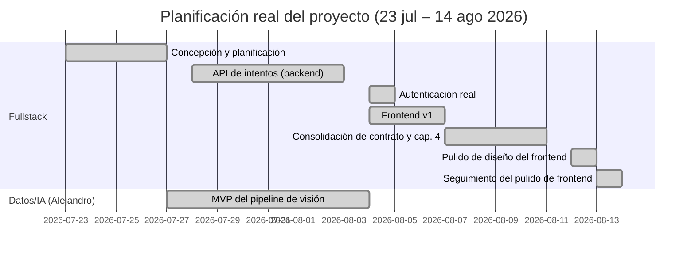

# 3. Planificación

> Fuente: `docs/superpowers/specs/2026-08-14-memoria-cap3-planificacion-design.md` (diseño
> aprobado). Fechas y fases derivadas directamente del historial de `git log` sobre `main` y
> `origin/cv-pipeline`, no estimadas.

Este proyecto se ha desarrollado en dos pistas paralelas que convergen en el contrato de API
backend↔servicio de visión artificial: la pista **Fullstack** (aplicación web, backend, base de
datos, infraestructura) y la pista **Datos/IA**, a cargo de Alejandro (pipeline de detección de
pose, cálculo de ángulos articulares, scoring). El diagrama y la narrativa que siguen cubren el
periodo real transcurrido hasta la fecha de redacción de este capítulo (14 de agosto de 2026); no
proyectan fases futuras aún sin fechas confirmadas (despliegue en AWS, capítulos restantes de la
memoria, mejoras de precisión del pipeline de visión).

