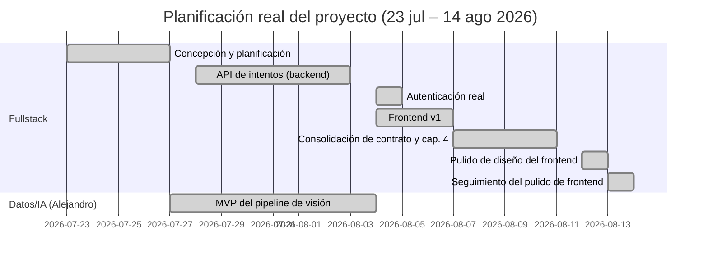

# 3. Planificación

<!--
Fuente: docs/superpowers/specs/2026-08-14-memoria-cap3-planificacion-design.md (diseño
aprobado). Fechas y fases derivadas directamente del historial de git log sobre main y
origin/cv-pipeline, no estimadas.
-->

Este proyecto se ha desarrollado en dos pistas paralelas que convergen en el contrato de API
backend↔servicio de visión artificial: la pista **Fullstack** (aplicación web, backend, base de
datos, infraestructura) y la pista **Datos/IA**, a cargo de Alejandro (pipeline de detección de
pose, cálculo de ángulos articulares, scoring). El diagrama y la narrativa que siguen cubren el
periodo real transcurrido hasta la fecha de redacción de este capítulo (14 de agosto de 2026); no
proyectan fases futuras aún sin fechas confirmadas (despliegue en AWS, capítulos restantes de la
memoria, mejoras de precisión del pipeline de visión).

## 3.1 Narrativa por fases

### 3.1.1 Fase 1 — Concepción y planificación (23–27 jul 2026)

Arranque del proyecto: commit inicial con la concepción y el esbozo de memoria
(`a4708bd`), seguido de la investigación de mercado y el diseño del contrato de API entre backend
y servicio de visión artificial (`1fa5358`) — el documento que permite a ambas pistas trabajar en
paralelo sin bloquearse mutuamente desde el primer día.

### 3.1.2 Fase 2 — API de intentos, backend (28 jul – 3 ago 2026)

Implementación completa de la API de intentos siguiendo un plan TDD de 14 tareas (`72ac0ed`):
modelos de base de datos, autenticación JWT de desarrollo, capa de almacenamiento, validación de
subidas, firma HMAC de webhooks, cliente del servicio de visión, endpoints de creación/consulta/
historial, recepción idempotente del webhook de resultado, reconciliador de sondeo y purga por
retención, además de un servicio de visión simulado (`fake-cv-service`) con un test end-to-end.

### 3.1.3 Fase 3 — MVP del pipeline de visión, Alejandro (27 jul – 4 ago 2026)

En paralelo, Alejandro desarrolla el MVP del pipeline de visión en la rama independiente
`cv-pipeline`: detección de pose, cálculo de ángulos articulares por repetición y lógica de
puntuación, expuestos como un servicio FastAPI real (`cv-service`). Injertado en `main` el 4 de
agosto (`3c6702f`), resolviendo los 4 huecos de compatibilidad identificados contra el contrato de
la Fase 1 (prefijo `/v1`, borrado GDPR, autenticación por clave, límites de subida confirmados).

### 3.1.4 Fase 4 — Autenticación real (4 ago 2026)

Sustitución del login de desarrollo por autenticación real: registro, login, refresco y cierre de
sesión, con tokens de refresco opacos y hasheados en base de datos y revocación en bloque ante
detección de reuso (`069b83e`).

### 3.1.5 Fase 5 — Frontend v1 (4–7 ago 2026)

Construcción completa de la aplicación web (Next.js): flujo de subida de video, sondeo de estado,
visualización de resultado con video anotado, historial de intentos, y páginas de login/registro,
con test end-to-end de Playwright cubriendo el ciclo completo. Fusionado a `main` mediante el
PR n.º 2 (`d511efd`) tras una revisión final que encontró y corrigió 9 hallazgos, incluyendo uno
crítico (la ruta de registro no era alcanzable desde ningún enlace de la interfaz).

### 3.1.6 Fase 6 — Consolidación de contrato y memoria Cap. 4 (7–11 ago 2026)

Cierre de huecos de integración entre pistas: documentación del flujo local completo con frontend,
corrección de un bug real de códec de video (`eeae94a` — el video anotado usaba MPEG-4 Part 2,
no reproducible en navegadores) encontrado al probar por primera vez el pipeline real (no el
simulado) desde la interfaz. En paralelo, redacción y fusión del capítulo 4 de esta memoria
(Requisitos) (`fab09b1`).

### 3.1.7 Fase 7 — Pulido de diseño del frontend (12 ago 2026)

Primera pasada de diseño visual dedicada sobre el frontend, hasta entonces funcional pero con el
aspecto por defecto de shadcn/ui: nueva paleta de color, cabecera compartida `AppShell`, escala
tipográfica consistente, y rediseño de las tarjetas de resultado e historial (`39b9e51`).

### 3.1.8 Fase 8 — Seguimiento del pulido de frontend (13–14 ago 2026)

Cierre de los 5 hallazgos menores diferidos de la revisión final de la Fase 7. Este seguimiento
tuvo un episodio no planeado: automatización de Gas Town (herramienta de orquestación de agentes
en prueba desde el 13 de agosto para el seguimiento de tareas) ejecutó de forma autónoma parte de
este mismo trabajo sin supervisión, requiriendo una reconciliación manual del código antes de
completarse (`667c47d`) — documentado como una lección operativa, no como parte del plan original.

## 3.2 Dependencia entre pistas: el trabajo pendiente de Alejandro

La pista de Datos/IA está concentrada en dos ráfagas (27–28 de julio y 4 de agosto; MVP entregado y
verificado end-to-end), pero queda inactiva a partir de esa fecha. El diseño de la solicitud a
Alejandro para implementar detección de errores de forma (`knee_valgus`, `insufficient_depth`,
`excessive_forward_lean`) se redactó el 7 de agosto (`f8105fa`) y el mensaje se redactó el 11 de
agosto (`c4ad6f9`). Alejandro respondió ese mismo 11 de agosto, pero solo para pedir poder ejecutar
el frontend en local contra su `cv-service` en desarrollo y así probar la detección de errores de
forma a medida que la construye — no para responder a las preguntas de diseño planteadas en el
mensaje. Esa petición de acceso se resolvió con una corrección del README de backend (`f7ad6b2`,
"add frontend step to the local dev loop"). A 14 de agosto de 2026, las preguntas de diseño
sustantivas (si y cómo detectar cada error de forma, y cómo calibrar la curva de puntuación) siguen
sin respuesta. Esto representa una dependencia real entre pistas: una categoría completa de
requisitos (ver capítulo 4) no tiene fecha de entrega comprometida hasta que esa respuesta llegue, y
se documenta aquí como tal en lugar de presentar ambas pistas como si hubieran avanzado de forma
continua y simétrica.
