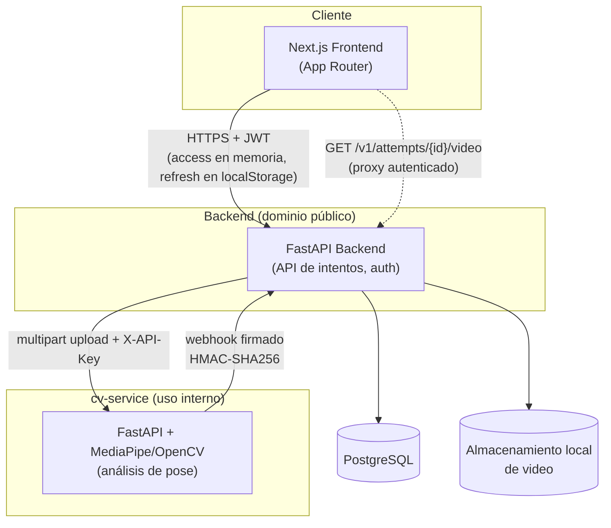
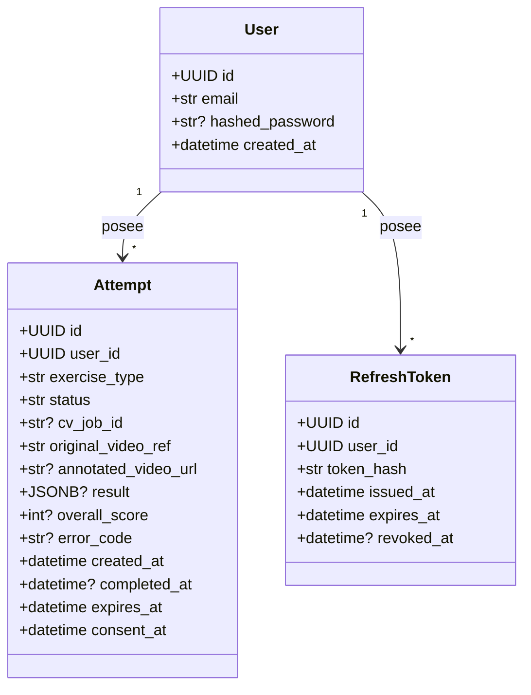

# 5. Diseño

> Fuente: `docs/superpowers/specs/2026-08-24-memoria-cap5-diseno-design.md` (diseño aprobado).
> Arquitectura y componentes descritos según el sistema realmente implementado, no según la
> propuesta original de `memoria-ada-outline.md` §5 (que mencionaba Redis, PyTorch y Express —
> ninguno de los tres existe en el sistema real).

## Arquitectura

El frontend llama al backend directamente desde el navegador — no existe una capa BFF
(*Backend-for-Frontend*) intermedia en Next.js; el token de acceso vive en memoria y el de
refresco en `localStorage` (`frontend/src/lib/api-client.ts`).

**Video anotado: proxy autenticado, nunca acceso directo.** La URL del video anotado que produce
cv-service nunca llega al navegador tal cual. El backend la reescribe a
`GET /v1/attempts/{attempt_id}/video` (`backend/app/api/attempts.py`), una ruta protegida por JWT
que descarga el video de cv-service usando la clave interna (`X-API-Key`) del backend y la
retransmite al usuario. Esta indirección existe por una razón concreta: la clave interna de
cv-service no debe llegar jamás al navegador de un usuario — si la URL original se expusiera
directamente, cualquiera con ella podría usarla para llamar a cv-service sin autenticarse como
usuario del sistema.

**Comunicación backend ↔ cv-service firmada.** Cada webhook que cv-service envía al backend al
terminar un análisis va firmado con HMAC-SHA256 sobre `timestamp + "." + body`
(`backend/app/security/signing.py`), con la firma y el timestamp en las cabeceras
`X-CV-Signature`/`X-CV-Timestamp`. El backend rechaza cualquier webhook cuya firma no coincida,
evitando que un tercero pueda falsificar el resultado de un análisis.

## Diagramas de uso

Diagrama de casos de uso derivado directamente de los 7 casos de uso funcionales del Capítulo 4
(`memoria/04-requisitos.md`) — Mermaid no tiene una notación UML de casos de uso nativa, por lo que
se usa un `flowchart` con el actor conectado a cada caso de uso, la alternativa habitual.

No existe ningún actor adicional (no hay rol de administrador en el sistema real) ni ningún caso de
uso fuera de estos 7 — este diagrama visualiza los requisitos del Capítulo 4, no añade alcance
nuevo.

## Diseño de clases

*(El sufijo `?` marca un campo nullable en la base de datos.)*

Estos son los 3 únicos modelos ORM reales (`backend/app/models/`). La propuesta original de
`memoria-ada-outline.md` §5 imaginaba clases separadas `Exercise`, `Score`, `Feedback/Tip` y
`VideoAsset` — ninguna existe como tabla o clase independiente en el sistema real. El score por
repetición, los códigos de error (`knee_valgus`/`insufficient_depth`/`excessive_forward_lean`) y
los consejos de mejora viven como **JSON anidado dentro de `Attempt.result`**, con la forma que
define el contrato de respuesta de cv-service — no como filas o clases propias. `exercise_type` es
un campo de texto plano, no una entidad `Exercise` normalizada, ya que hoy solo existe un ejercicio
soportado (sentadilla). Esta es una simplificación deliberada del sistema real, no una omisión de
este diagrama.
