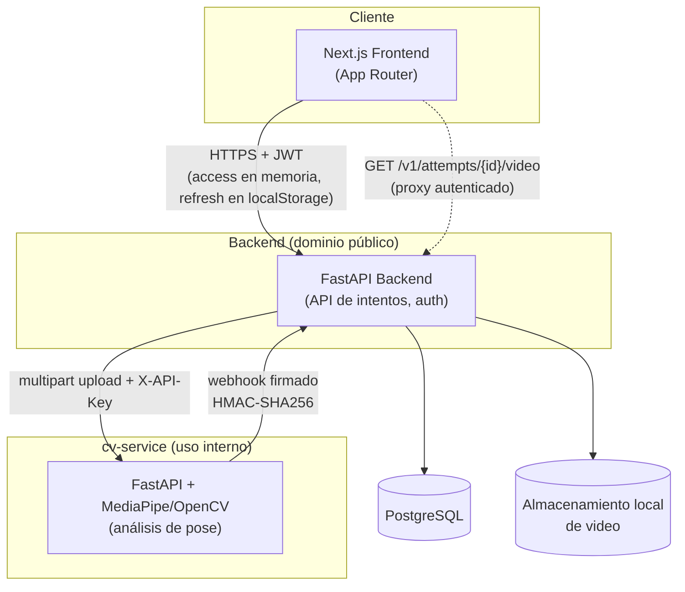

# 5. Diseño

> Fuente: `docs/superpowers/specs/2026-08-24-memoria-cap5-diseno-design.md` (diseño aprobado).
> Arquitectura y componentes descritos según el sistema realmente implementado, no según la
> propuesta original de `memoria-ada-outline.md` §5 (que mencionaba Redis, PyTorch y Express —
> ninguno de los tres existe en el sistema real).

## Arquitectura

El frontend llama al backend directamente desde el navegador — no existe una capa BFF
(*Backend-for-Frontend*) intermedia en Next.js; el token de acceso vive en memoria y el de
refresco en `localStorage` (`frontend/src/lib/api-client.ts`).

**Video anotado: proxy autenticado, nunca acceso directo.** La URL del video anotado que produce
cv-service nunca llega al navegador tal cual. El backend la reescribe a
`GET /v1/attempts/{attempt_id}/video` (`backend/app/api/attempts.py`), una ruta protegida por JWT
que descarga el video de cv-service usando la clave interna (`X-API-Key`) del backend y la
retransmite al usuario. Esta indirección existe por una razón concreta: la clave interna de
cv-service no debe llegar jamás al navegador de un usuario — si la URL original se expusiera
directamente, cualquiera con ella podría usarla para llamar a cv-service sin autenticarse como
usuario del sistema.

**Comunicación backend ↔ cv-service firmada.** Cada webhook que cv-service envía al backend al
terminar un análisis va firmado con HMAC-SHA256 sobre `timestamp + "." + body`
(`backend/app/security/signing.py`), con la firma y el timestamp en las cabeceras
`X-CV-Signature`/`X-CV-Timestamp`. El backend rechaza cualquier webhook cuya firma no coincida,
evitando que un tercero pueda falsificar el resultado de un análisis.
