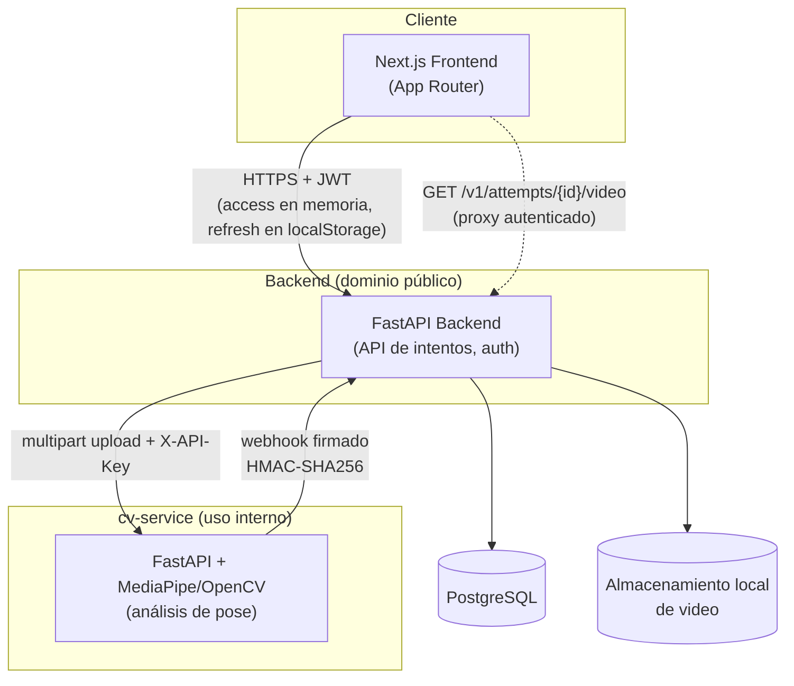
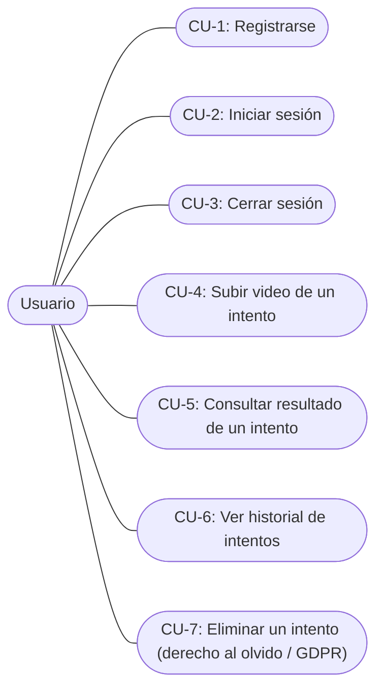
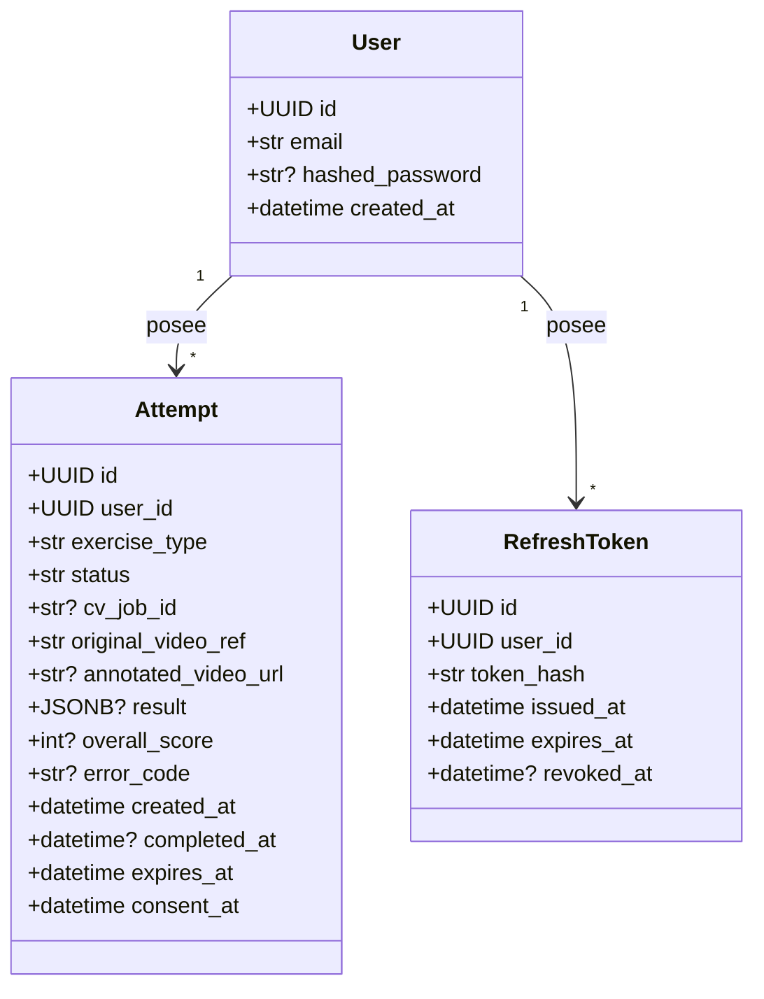
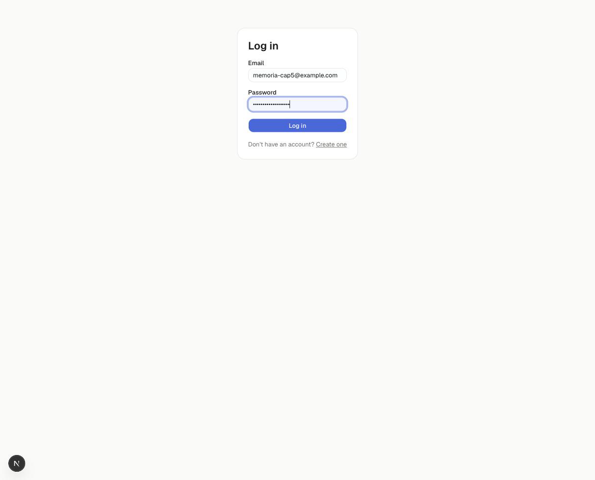
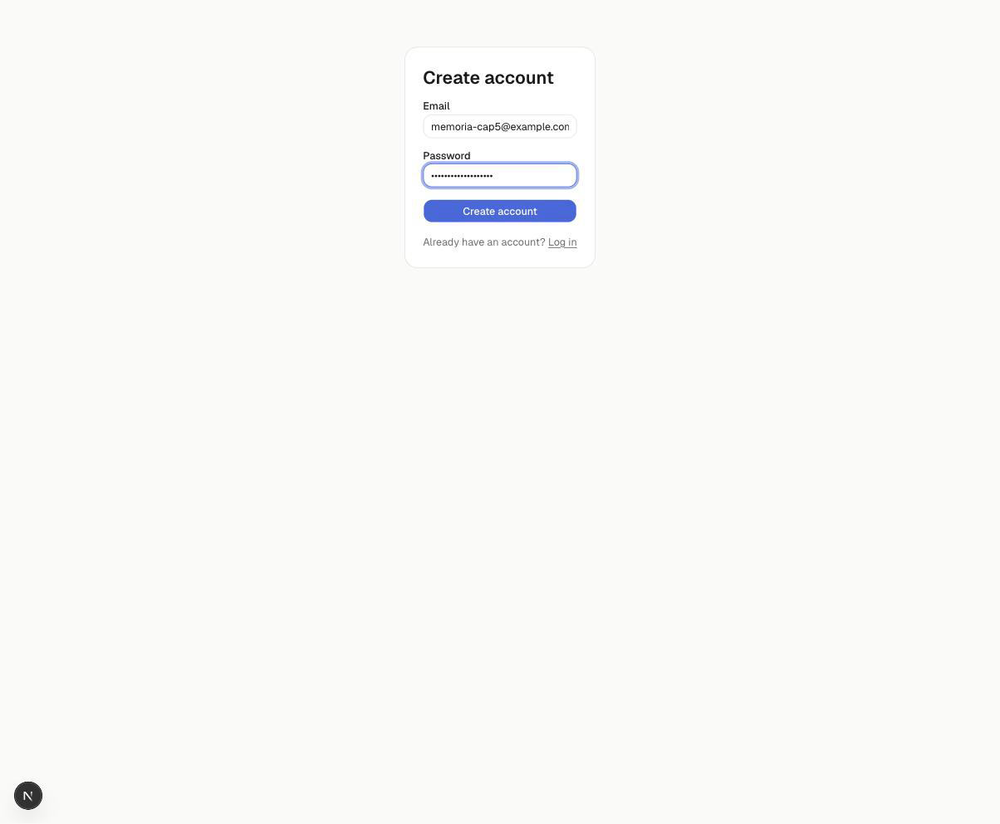
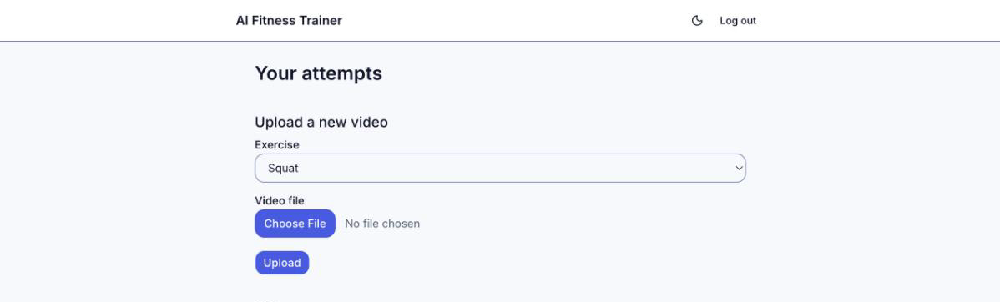
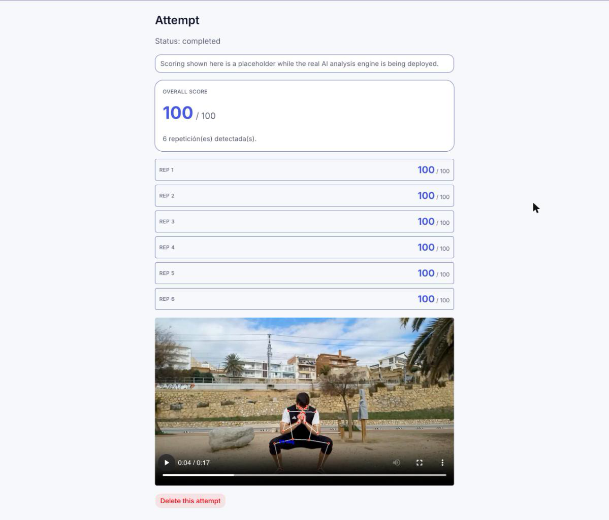
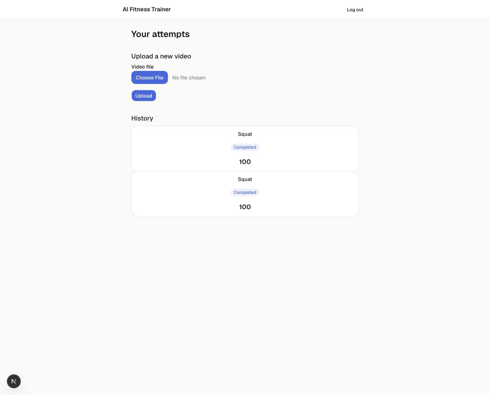

# 5. Diseño

> Fuente: `docs/superpowers/specs/2026-08-24-memoria-cap5-diseno-design.md` (diseño aprobado).
> Arquitectura y componentes descritos según el sistema realmente implementado, no según la
> propuesta original de `memoria-ada-outline.md` §5 (que mencionaba Redis, PyTorch y Express —
> ninguno de los tres existe en el sistema real).

## Arquitectura

El frontend llama al backend directamente desde el navegador — no existe una capa BFF
(*Backend-for-Frontend*) intermedia en Next.js; el token de acceso vive en memoria y el de
refresco en `localStorage` (`frontend/src/lib/api-client.ts`).

**Video anotado: proxy autenticado, nunca acceso directo.** La URL del video anotado que produce
cv-service nunca llega al navegador tal cual. El backend la reescribe a
`GET /v1/attempts/{attempt_id}/video` (`backend/app/api/attempts.py`), una ruta protegida por JWT
que descarga el video de cv-service usando la clave interna (`X-API-Key`) del backend y la
retransmite al usuario. Esta indirección existe por una razón concreta: la clave interna de
cv-service no debe llegar jamás al navegador de un usuario — si la URL original se expusiera
directamente, cualquiera con ella podría usarla para llamar a cv-service sin autenticarse como
usuario del sistema.

**Comunicación backend ↔ cv-service firmada.** Cada webhook que cv-service envía al backend al
terminar un análisis va firmado con HMAC-SHA256 sobre `timestamp + "." + body`
(`backend/app/security/signing.py`), con la firma y el timestamp en las cabeceras
`X-CV-Signature`/`X-CV-Timestamp`. El backend rechaza cualquier webhook cuya firma no coincida,
evitando que un tercero pueda falsificar el resultado de un análisis.

## Diagramas de uso

Diagrama de casos de uso derivado directamente de los 7 casos de uso funcionales del Capítulo 4
(`memoria/04-requisitos.md`) — Mermaid no tiene una notación UML de casos de uso nativa, por lo que
se usa un `flowchart` con el actor conectado a cada caso de uso, la alternativa habitual.

No existe ningún actor adicional (no hay rol de administrador en el sistema real) ni ningún caso de
uso fuera de estos 7 — este diagrama visualiza los requisitos del Capítulo 4, no añade alcance
nuevo.

## Diseño de clases

*(El sufijo `?` marca un campo nullable en la base de datos.)*

*(Las asociaciones del diagrama (`posee`) están implementadas a nivel de clave foránea con
`ForeignKey(..., ondelete="CASCADE")` (`backend/app/models/attempt.py` y `refresh_token.py`), no
como atributos `relationship()` de SQLAlchemy. Ese `ON DELETE CASCADE` es, además, parte de lo que
respalda el borrado GDPR: al eliminar un `User` la base de datos elimina en cascada sus `Attempt` y
`RefreshToken`.)*

Estos son los 3 únicos modelos ORM reales (`backend/app/models/`). La propuesta original de
`memoria-ada-outline.md` §5 imaginaba clases separadas `Exercise`, `Score`, `Feedback/Tip` y
`VideoAsset` — ninguna existe como tabla o clase independiente en el sistema real. El score por
repetición, los códigos de error (`knee_valgus`/`insufficient_depth`/`excessive_forward_lean`) y
los consejos de mejora viven como **JSON anidado dentro de `Attempt.result`**, con la forma que
define el contrato de respuesta de cv-service — no como filas o clases propias. `exercise_type` es
un campo de texto plano, no una entidad `Exercise` normalizada, ya que hoy solo existe un ejercicio
soportado (sentadilla). Esta es una simplificación deliberada del sistema real, no una omisión de
este diagrama.

## Diseño de interfaz

A diferencia del resto de este capítulo, esta sección no usa wireframes sino **capturas reales de
las pantallas ya implementadas**, obtenidas ejecutando la aplicación en local. El despliegue real
se documenta en `deploy/README.md` y queda fuera del alcance de este capítulo.

### Inicio de sesión (CU-2)

Formulario de email y contraseña. Un fallo de autenticación se comunica como "Invalid email or
password" — un mensaje deliberadamente distinguible de un error de red o de servidor (ver
`frontend/src/lib/auth-context.tsx`).

### Registro (CU-1)

Formulario de alta de cuenta. Al completarse, el backend crea la cuenta y devuelve de inmediato un
par de tokens (access + refresh) — el usuario queda autenticado sin pasar por login.

### Subida de video (CU-4)

Formulario de subida en la página de inicio autenticada. Valida extensión (`.mp4`/`.mov`) y tamaño
(≤100 MB) en el cliente antes de enviar (`frontend/src/components/video-upload-form.tsx`); el
backend revalida extensión, tamaño, códec (solo H.264) y duración (≤60 s) en
`backend/app/services/validation.py`.

### Resultado de un intento (CU-5)

Muestra el score global, el video anotado (reproducido mediante un *blob URL* obtenido vía
`fetch` autenticado — nunca un `<video src>` directo, ya que eso no envía la cabecera de
autorización) y el desglose por repetición, incluyendo los códigos de error que el *pipeline*
evalúa hoy (`insufficient_depth` y `excessive_forward_lean`) cuando aplican. Existe un tercer
código, `knee_valgus`, en el contrato (`backend/app/schemas/contract.py`) y en el mapa de etiquetas
del frontend (`frontend/src/lib/form-error-messages.ts`), pero no se evalúa actualmente porque
`cv-service/pipeline.py` asume una única cámara sagital (lateral) y detectar el valgo de rodilla
exige una vista frontal.

### Historial de intentos (CU-6)

Lista paginada de intentos propios, ordenada por fecha, con una píldora de estado por intento
(en cola/procesando/completado/fallido). En la implementación actual esta lista vive en la propia
página de inicio (`frontend/src/app/page.tsx`, sección "History"), no en una ruta `/attempts`
separada — no existe una vista de historial standalone.

## Diseño de persistencia de datos

**Gestión del esquema:** migraciones Alembic (`backend/alembic/versions/`), cabeza actual en la
revisión `0002` (`0002_auth.py`, tras `0001_initial.py`) — 4 tablas reales en total (los 3 modelos
de la sección «Diseño de clases» más la tabla interna de control de versiones de Alembic).

**Diseño de borrado (GDPR, CU-7):** `delete_attempt`
(`backend/app/services/attempts.py`) sigue un orden deliberado, no incidental:

1. Se borra primero el archivo de video local (`storage.delete(...)`).
2. Se solicita después a cv-service el borrado del job asociado, si existe uno.
3. Se borra la fila de la base de datos en último lugar, y solo entonces se confirma la
   transacción.

Este orden garantiza que, si la llamada a cv-service falla, la excepción se propaga *antes* de
borrar la fila — el intento sobrevive y el usuario puede reintentar el borrado, en vez de que la
aplicación reporte falsamente un borrado GDPR que en realidad no se completó del todo.

**Retención y reconciliación:** cada `Attempt` tiene un campo `expires_at`; una tarea en segundo
plano (`purge_expired_attempts`, "purge", cada 6h) borra automáticamente los intentos que superan
su fecha de expiración (30 días desde la subida) mediante la misma ruta de borrado que CU-7. Una
segunda tarea periódica, `reconcile_stale_attempts` (`backend/app/services/jobs.py`, cada 30 s),
re-sincroniza
los intentos que se quedaron atascados en `queued`/`processing` consultando directamente a
cv-service cuando el webhook de resultado nunca llegó.

**Almacenamiento de video:** disco local, detrás de una interfaz `Storage`
(`backend/app/services/storage.py`) con una única implementación real, `LocalFilesystemStorage` —
deliberadamente no S3 ni ningún almacenamiento en la nube, en línea con la restricción de
despliegue gratuito del proyecto.
