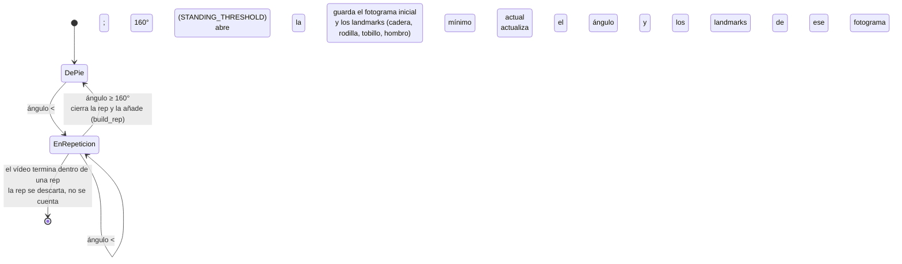

# 6. Implementación

> Fuente: `docs/superpowers/specs/2026-08-28-memoria-cap6-implementacion-design.md` (diseño
> aprobado). Este capítulo describe **tecnologías y algoritmos**, no el código en sí (según la
> estructura de `memoria-ada-outline.md` §6). Los detalles del despliegue —aprovisionamiento de la
> máquina, CI/CD, verificación en producción— están en el §12 (Anexos), no aquí. La arquitectura,
> el diseño de clases y el diseño de persistencia se describen en el §5 y aquí solo se referencian.

## 6.1 Pipeline de análisis de movimiento (cv-service)

El análisis de la sentadilla lo desarrolla Alejandro (línea de Datos/IA) y está integrado en este
mismo repositorio como el servicio `cv-service`. El código vive en `cv-service/pipeline.py` y sus
constantes están documentadas en `cv-service/GLOSARIO.md`. Esta sección lo describe en detalle
técnico a partir de ese código.

### 6.1.1 Extracción de pose

La detección de pose usa **MediaPipe Pose** (`mp.solutions.pose`, `mediapipe==0.10.14`), un
detector **pre-entrenado y usado tal cual** —no se entrena ningún modelo propio—. Se crea una única
instancia `Pose` por trabajo, con `min_detection_confidence=0.5` y `min_tracking_confidence=0.5`.

Por cada fotograma: OpenCV (`cv2.VideoCapture`) lo lee en formato BGR, se convierte a RGB
(`cv2.cvtColor(..., COLOR_BGR2RGB)`) y se pasa a `pose.process(...)`. Los fotogramas en los que
MediaPipe no detecta a ninguna persona simplemente se saltan: no se cuentan ni se les dibuja
esqueleto. Si **ningún** fotograma del vídeo produce una pose, el trabajo termina en fallo con el
código `no_pose_detected` (excepción `NoPoseDetectedError`).

De todos los puntos que devuelve MediaPipe se usan **solo cuatro**, todos del lado derecho del
cuerpo: cadera (`RIGHT_HIP`), rodilla (`RIGHT_KNEE`), tobillo (`RIGHT_ANKLE`) y hombro
(`RIGHT_SHOULDER`). Las coordenadas, que MediaPipe entrega normalizadas a [0, 1], se
des-normalizan a píxeles multiplicándolas por el ancho y el alto del fotograma.

Esto codifica una **suposición explícita del pipeline: una sola cámara lateral (plano sagital)**,
con el lado derecho del atleta hacia ella. Es la misma suposición que hace que el valgo de rodilla
(`knee_valgus`, un defecto del plano frontal) sea indetectable **por diseño**, no por falta de
implementación (§4 CU-5, §5).

### 6.1.2 Ángulo de rodilla

El ángulo de rodilla es el ángulo interior con vértice en `b` de los tres puntos `a-b-c` =
(cadera, rodilla, tobillo):

$$\theta = \arccos\!\left(\frac{\vec{ba}\cdot\vec{bc}}{\lVert\vec{ba}\rVert\,\lVert\vec{bc}\rVert}\right)$$

Se calcula en coordenadas 2D de imagen (`calculate_angle`), acotando el argumento a $[-1, 1]$ antes
de `arccos` para absorber el error de redondeo en coma flotante, y el resultado se pasa a grados.

Conviene fijar la **convención**: este ángulo interior cadera-rodilla-tobillo vale ~180° con la
pierna extendida (de pie) y **disminuye** a medida que la rodilla se flexiona. Es, por tanto,
aproximadamente el *complementario* del "ángulo de flexión" que se usa en la literatura de
biomecánica (que mide desde la extensión completa): ~90° de flexión de rodilla equivalen aquí a un
ángulo interior de ~90–100°. Esta convención es la que hay que tener presente al leer los umbrales
de §6.1.4.

La **inclinación del torso** (`torso_lean_from_vertical`) es el ángulo entre el vector
cadera→hombro y la vertical de la imagen; 0° = torso perfectamente erguido. Se implementa reusando
`calculate_angle` con un punto sintético justo encima de la cadera, en vez de repetir el cálculo a
mano. Es **solo la magnitud** de la inclinación —no distingue adelante de atrás—; esa distinción la
resuelve `is_excessive_forward_lean` (§6.1.4). Solo se usa ahí.

### 6.1.3 Segmentación en repeticiones

La secuencia de ángulos de rodilla fotograma a fotograma se agrupa en repeticiones completas con
una **máquina de estados** sencilla (`segment_reps`). En el código son dos estados: *de pie* y
*dentro de una repetición* (la variable pasa a `"descending"` al abrir la rep y no vuelve a
cambiar hasta cerrarla).

- El umbral `STANDING_THRESHOLD = 160°` separa "de pie" de "en movimiento".
- Mientras dura la repetición se guarda el **ángulo mínimo** alcanzado y las coordenadas de los
  cuatro landmarks *en ese fotograma concreto* —se necesitan para evaluar `excessive_forward_lean`
  justo en el punto más bajo de la sentadilla, no en un fotograma cualquiera (§6.1.4)—.
- Una repetición que empieza pero nunca vuelve a "de pie" (vídeo cortado a mitad de rep) se
  **descarta**, no se cuenta.

Los fotogramas por segundo (`fps`) se leen de OpenCV (`CAP_PROP_FPS`, con 30 por defecto si el
contenedor no lo informa); los tiempos de inicio y fin de cada repetición son `nº de fotograma /
fps`, redondeados a dos decimales.
