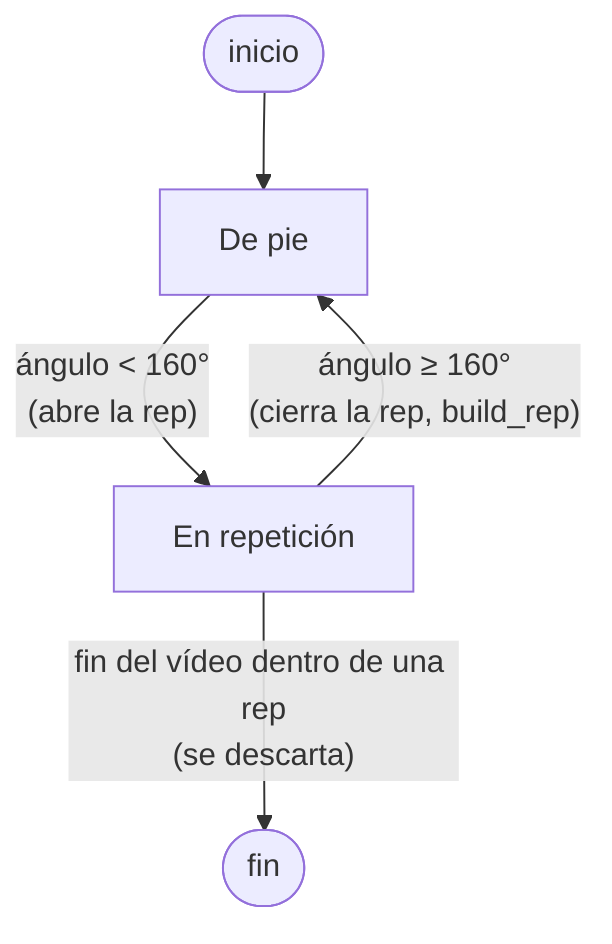

# 6. Implementación

> Fuente: `docs/superpowers/specs/2026-08-28-memoria-cap6-implementacion-design.md` (diseño
> aprobado). Este capítulo describe **tecnologías y algoritmos**, no el código en sí (según la
> estructura de `memoria-ada-outline.md` §6). Los detalles del despliegue —aprovisionamiento de la
> máquina, CI/CD, verificación en producción— están en el §12 (Anexos), no aquí. La arquitectura,
> el diseño de clases y el diseño de persistencia se describen en el §5 y aquí solo se referencian.

## 6.1 Pipeline de análisis de movimiento (cv-service)

El análisis de la sentadilla lo desarrolla Alejandro (pista de Datos/IA) y está integrado en este
mismo repositorio como el servicio `cv-service`. El código vive en `cv-service/pipeline.py` y sus
constantes están documentadas en `cv-service/GLOSARIO.md`. Esta sección lo describe en detalle
técnico a partir de ese código.

### 6.1.1 Extracción de pose

La detección de pose usa **MediaPipe Pose** (`mp.solutions.pose`, `mediapipe==0.10.14`), un
detector **pre-entrenado y usado tal cual** —no se entrena ningún modelo propio—. Se crea una única
instancia `Pose` por trabajo, con `min_detection_confidence=0.5` y `min_tracking_confidence=0.5`.

Por cada fotograma: OpenCV (`cv2.VideoCapture`) lo lee en formato BGR, se convierte a RGB
(`cv2.cvtColor(..., COLOR_BGR2RGB)`) y se pasa a `pose.process(...)`. Los fotogramas en los que
MediaPipe no detecta a ninguna persona se ignoran **para el análisis** —no se cuentan ni se les
dibuja esqueleto—, pero se escriben igual al video de salida, sin anotar (§6.1.5). Si **ningún**
fotograma del video produce una pose, el trabajo termina en fallo con el código `no_pose_detected`
(excepción `NoPoseDetectedError`).

De todos los puntos de referencia (*landmarks*) que devuelve MediaPipe se usan **solo cuatro**,
todos del lado derecho del cuerpo: cadera (`RIGHT_HIP`), rodilla (`RIGHT_KNEE`), tobillo
(`RIGHT_ANKLE`) y hombro (`RIGHT_SHOULDER`). Las coordenadas, que MediaPipe entrega normalizadas a
[0, 1], se desnormalizan a píxeles multiplicándolas por el ancho y el alto del fotograma.

Esto codifica una **suposición explícita del pipeline: una sola cámara lateral (plano sagital)**,
con el lado derecho del atleta hacia ella. Es la misma suposición que hace que el valgo de rodilla
(`knee_valgus`, un defecto del plano frontal) sea indetectable **por diseño**, no por falta de
implementación (§4 CU-5, §5).

### 6.1.2 Ángulo de rodilla

El ángulo de rodilla es el ángulo interior con vértice en `b` de los tres puntos `a-b-c` =
(cadera, rodilla, tobillo):

$$\theta = \arccos\!\left(\frac{\vec{ba}\cdot\vec{bc}}{\lVert\vec{ba}\rVert\,\lVert\vec{bc}\rVert}\right)$$

Se calcula en coordenadas 2D de imagen (`calculate_angle`), acotando el argumento a $[-1, 1]$ antes
de `arccos` para absorber el error de redondeo en coma flotante, y el resultado se pasa a grados.

Conviene fijar la **convención**: este ángulo interior cadera-rodilla-tobillo vale ~180° con la
pierna extendida (de pie) y **disminuye** a medida que la rodilla se flexiona. Es, por tanto,
aproximadamente el *suplementario* del "ángulo de flexión" que se usa en la literatura de
biomecánica (que mide desde la extensión completa): ángulo interior ≈ 180° − flexión, de modo que
~90° de flexión de rodilla equivalen aquí a un ángulo interior de ~90–100°. Esta convención es la
que hay que tener presente al leer los umbrales de §6.1.4.

La **inclinación del torso** (`torso_lean_from_vertical`) es el ángulo entre el vector
cadera→hombro y la vertical de la imagen; 0° = torso perfectamente erguido. Se implementa reusando
`calculate_angle` con un punto sintético justo encima de la cadera, en vez de repetir el cálculo a
mano. Es **solo la magnitud** de la inclinación —no distingue adelante de atrás—; esa distinción la
resuelve `is_excessive_forward_lean` (§6.1.4). Solo se usa ahí.

### 6.1.3 Segmentación en repeticiones

La secuencia de ángulos de rodilla fotograma a fotograma se agrupa en repeticiones completas con
una **máquina de estados** sencilla (`segment_reps`). En el código son dos estados: *de pie* y
*dentro de una repetición* (al abrir la rep se pasa a este segundo estado y no se vuelve a cambiar
hasta cerrarla).

- El umbral `STANDING_THRESHOLD = 160°` separa "de pie" de "en movimiento".
- Dentro del estado *En repetición*, cada fotograma con un ángulo menor que el mínimo visto hasta
  entonces actualiza ese **ángulo mínimo** y guarda las coordenadas de los cuatro *landmarks* *de
  ese fotograma concreto* —se necesitan para evaluar `excessive_forward_lean` justo en el punto más
  bajo de la sentadilla, no en un fotograma cualquiera (§6.1.4)—.
- Una repetición que empieza pero nunca vuelve a "de pie" (video cortado a mitad de rep) se
  **descarta**, no se cuenta.

Los fotogramas por segundo (`fps`) se leen de OpenCV (`CAP_PROP_FPS`, con 30 por defecto si el
contenedor no lo informa); los tiempos de inicio y fin de cada repetición son `nº de fotograma /
fps`, redondeados a dos decimales.

### 6.1.4 Puntuación y errores de forma

La puntuación **por repetición** (`score_from_angle`) es una curva **de un solo lado**: penaliza
quedarse corto de profundidad, nunca pasarse.

$$
\text{score}(a_{\min}) =
\begin{cases}
100 & \text{si } a_{\min} \le G \\[6pt]
\max\!\big(0,\ \operatorname{round}(100 - (a_{\min} - G) \cdot p)\big) & \text{si } a_{\min} > G
\end{cases}
$$

donde $G$ = `GOOD_DEPTH_ANGLE_DEG` = 100° (umbral de buena profundidad) y $p$ =
`PENALTY_PER_DEGREE` = 3 (puntos restados por cada grado por encima de $G$). Bajar **más** del
umbral (mayor flexión, sentadilla más profunda) no resta nunca; solo resta no llegar. El razonamiento, citado en
`GLOSARIO.md`: **Schoenfeld (2010)**, *Squatting Kinematics and Kinetics and Their Application to
Exercise Performance*, y la posición de la **NSCA** (*Considerations for Squat Depth*) de que «la
evidencia científica no sostiene que la sentadilla completa exponga la rodilla a fuerzas de
compresión dañinas», en contra del mito de que «más profundo es más riesgoso». (Antes existía una
banda de dos límites, `GOOD_DEPTH_MIN`/`GOOD_DEPTH_MAX` = 70°–100°, que también penalizaba pasarse
de profundo; se colapsó a este único umbral.)

La puntuación **global** (`overall_score`) es la media de las puntuaciones por repetición,
redondeada; 0 si no se segmentó ninguna repetición.

Los **códigos de error de forma** por repetición (`build_rep`) salen del catálogo cerrado
`FormErrorCode` (`backend/app/schemas/contract.py`), que contiene exactamente `knee_valgus`,
`insufficient_depth` y `excessive_forward_lean`:

- **`insufficient_depth`** — `ángulo_mínimo > GOOD_DEPTH_ANGLE_DEG`.
- **`excessive_forward_lean`** — se evalúa en el fotograma del ángulo mínimo mediante
  `is_excessive_forward_lean(cadera, rodilla, tobillo, hombro)`, que solo marca el error si se
  cumplen **las tres** condiciones: (1) los vectores cadera→hombro y tobillo→rodilla miden al menos
  `MIN_TORSO_VECTOR_NORM_PX = 1 px` (si no, los *landmarks* están demasiado juntos y su dirección es
  ruido de seguimiento de sub-píxel: no se marca nada, en vez de adivinar); (2) el hombro se
  desplaza (respecto a la cadera) hacia el mismo lado horizontal en el que la rodilla queda por
  delante del tobillo —esa relación rodilla-tobillo define "adelante" de forma independiente de
  hacia dónde mire la cámara, y una inclinación hacia atrás no cuenta—; (3) la magnitud de la
  inclinación de torso (`torso_lean_from_vertical`) supera `EXCESSIVE_LEAN_DEG = 45°`. El umbral de
  45° es un **punto de partida heurístico**, no una cifra de la literatura (así lo dice
  `GLOSARIO.md`). *Historia:* la primera versión solo comprobaba la magnitud y no distinguía
  adelante de atrás, con lo que una inclinación hacia **atrás** se etiquetaba igual como
  `excessive_forward_lean`; una revisión de código lo detectó el 20/08/2026
  (`docs/2026-08-20-alejandro-cv-form-error-detection-followup-message.md`) y el commit `a5ad6b8`
  (integrado en `main` el 31/08/2026) lo hizo direccional y añadió la comprobación de norma mínima.
  *Limitación documentada* (`GLOSARIO.md`, no es un bug): una sentadilla muy *hip-dominant* / de
  barra baja puede inclinar el torso hacia adelante sin que la rodilla avance sobre el tobillo —las
  dos señales no coinciden y el error no se marca aunque visualmente la inclinación sea excesiva—.
- **`knee_valgus`** — está en el catálogo y en el mapa de etiquetas del frontend
  (`frontend/src/lib/form-error-messages.ts`), pero **no se evalúa, por diseño**: es un defecto del
  plano frontal y el pipeline asume una única cámara lateral (§4 CU-5, §5). Nunca se añade a
  `errors`: no hay lógica que lo evalúe.

| Constante | Valor | Papel | Fuente |
|---|---|---|---|
| `STANDING_THRESHOLD` | 160° | Ángulo de rodilla a partir del cual se considera "de pie" (abre/cierra rep). | Heurística |
| `GOOD_DEPTH_ANGLE_DEG` | 100° | Umbral de "buena profundidad": por debajo o igual no se penaliza ni se marca `insufficient_depth`. | Schoenfeld 2010 / NSCA |
| `PENALTY_PER_DEGREE` | 3 | Puntos restados por cada grado por encima de `GOOD_DEPTH_ANGLE_DEG`. | Heurística |
| `EXCESSIVE_LEAN_DEG` | 45° | Magnitud de inclinación de torso por encima de la cual se marca `excessive_forward_lean`. | Punto de partida heurístico |
| `MIN_TORSO_VECTOR_NORM_PX` | 1 px | Norma mínima de un vector de *landmarks* para fiarse de su dirección. | Salvaguarda frente al ruido de seguimiento |
| `ANNOTATED_VIDEO_FOURCC` | `avc1` | Códec del video anotado (H.264). | Compatibilidad con `<video>` (§6.1.5) |

### 6.1.5 Video anotado

En cada fotograma con pose detectada se dibuja el esqueleto (`mp_drawing.draw_landmarks` con
`POSE_CONNECTIONS`) y el ángulo de rodilla entero como texto junto a la rodilla (`cv2.putText`,
`"<n> deg"`). **Todos** los fotogramas —anotados o no— se escriben al video de salida
(`writer.write(frame)`).

El códec es `ANNOTATED_VIDEO_FOURCC = cv2.VideoWriter_fourcc(*"avc1")`. Conviene explicar **por qué
no es el `mp4v` obvio**: los navegadores no decodifican MPEG-4 Part 2 en `<video>` —solo
H.264/AVC, VP8/VP9 o AV1 (y HEVC en Safari)—, así que un archivo `mp4v` se reproduce como un
fotograma en blanco en la página de resultados. `avc1` produce H.264 real con este build de
OpenCV, sin necesitar un post-proceso con `ffmpeg`. Fue un bug real, detectado la primera vez que
se reprodujo en un navegador un video del pipeline **real** (no el simulado) — commit `eeae94a`,
*"encode annotated video as H.264, not MPEG-4 Part 2"* (§3, Fase 6).

### 6.1.6 Naturaleza del pipeline

MediaPipe Pose es un detector pre-entrenado usado tal cual; **todo lo que hay aguas abajo**
—ángulos, máquina de estados, umbrales, puntuación— son **reglas deterministas**, ajustadas por
constantes, no aprendidas. No hay conjunto de entrenamiento ni cifra de *accuracy* / *precision* /
*recall*: la pregunta de fiabilidad que sí tiene sentido (contar bien las repeticiones sobre video
real) se plantea en §4 (RNF-4) y se evalúa en §7. El campo `algorithm_version` del resultado es la
cadena literal `"squat-rules-v1"` y `exercise_type` es `"squat"`.

## 6.2 Aplicación web

### 6.2.1 Contrato e integración entre servicios

El contrato interno entre el backend y `cv-service` está definido en un único módulo de esquemas
del lado del backend (`backend/app/schemas/contract.py`). El backend lo valida con Pydantic **en
ambos sentidos**: la respuesta síncrona de `POST /v1/jobs` (`JobAccepted.model_validate` en
`backend/app/services/cv_client.py`) y el cuerpo del webhook (`JobStatus.model_validate_json` en
`backend/app/api/webhooks.py`). `cv-service` no tiene módulo de esquemas propio ni valida los
payloads con uno: construye sus respuestas como diccionarios conforme a ese mismo contrato, cuyo
diseño se detalla en el §5. El flujo de un análisis, de principio a fin:

1. **`POST /v1/attempts`** (multipart: `video`, `exercise_type`) → el backend valida la subida
   (`backend/app/services/validation.py`): extensión `.mp4`/`.mov`, ≤ 100 MB, códec de video
   H.264 y duración ≤ 60 s. La duración y el códec se comprueban con **PyAV** leyendo los
   metadatos del contenedor, no lanzando `ffprobe`. Si pasa, guarda el video original a través
   de la interfaz `Storage`, lo envía a `cv-service` y crea la fila `Attempt` en estado `queued`
   con el identificador de trabajo que `cv-service` devuelve.
2. **Backend → `cv-service` `POST /v1/jobs`** (`backend/app/services/cv_client.py`): multipart con
   el video más el campo `exercise_type` y `callback_url`, con la cabecera `X-API-Key` (clave
   interna, nunca expuesta al navegador).
3. **`cv-service` procesa el trabajo de forma asíncrona con `BackgroundTasks` de FastAPI**
   (`cv-service/main.py`, `cv-service/jobs.py`) — **sin cola de tareas**; el estado vive en un
   diccionario en memoria del proceso y se pierde si se reinicia, lo cual es aceptable
   precisamente por el paso 5.
4. Al terminar, `cv-service` hace `POST` del resultado al webhook del backend
   (`/v1/cv-callback/{attempt_id}`) con una **firma HMAC-SHA256** sobre `timestamp + "." + body`,
   en cabeceras `X-CV-Signature` / `X-CV-Timestamp`; el backend rechaza cualquier firma que no
   cuadre o cuyo timestamp caiga fuera de una ventana de 300 s. El *porqué* del diseño de la firma
   está en el §5; aquí solo se nombra como parte del flujo.
5. **Reconciliador por *polling*** (`reconcile_stale_attempts`, `backend/app/services/jobs.py`,
   APScheduler cada 30 s): todo intento que tenga un `cv_job_id` asignado y siga no terminal
   30 s después de crearse se consulta directamente a `cv-service` (`GET /v1/jobs/{id}`). Este es
   el mecanismo de respaldo real cuando un webhook se pierde — **el webhook es una optimización, no
   la fuente de verdad**.
6. **Aplicación exactamente una vez:** tanto el webhook como el reconciliador llaman a
   `apply_job_status` (`backend/app/services/attempts.py`), que hace `SELECT … FOR UPDATE` sobre el
   intento y sale sin hacer nada si ya está en estado terminal — así, un resultado entregado dos
   veces, o por ambas vías, se aplica una sola vez. Al aplicarlo, la `annotated_video_url` que
   devuelve `cv-service` se reescribe a la ruta *proxy* autenticada del backend **antes** de
   guardarla (diseño en el §5).

Una tarea programada aparte (`purge_expired_attempts`, cada 6 h) borra los intentos que superan su
ventana de retención (`expires_at`, 30 días); se nombra aquí, su diseño es el del §5.

### 6.2.2 Decisiones tecnológicas

- **FastAPI en los dos servicios.** `cv-service` *tiene* que ser Python (MediaPipe/OpenCV). El
  backend es FastAPI también: un solo lenguaje en todo el proyecto, asincronía nativa para la ida
  y vuelta con `cv-service`, y modelos Pydantic que hacen de contrato validado
  (`backend/app/schemas/contract.py`). Persistencia con SQLAlchemy en modo *async*
  (`sqlalchemy[asyncio]`, driver `asyncpg`) más Alembic para las migraciones, sobre PostgreSQL. La
  propuesta previa al código planteaba "FastAPI frente a Express" y una base con modelo entrenado
  — ninguna de las dos cosas se sostuvo: FastAPI en ambos servicios, y reglas deterministas sin
  entrenamiento (§6.1.6).
- **Next.js (App Router)** en el frontend; el navegador habla directamente con la URL base del
  backend (`NEXT_PUBLIC_API_BASE_URL`, `frontend/src/lib/api-client.ts`), con el *access token*
  en memoria y el *refresh token* en `localStorage` — sin capa BFF ni *proxy* de rutas de API
  intermedio (decisión registrada en el §5 y en
  `docs/superpowers/specs/2026-08-04-frontend-design.md`).
- **Omisiones deliberadas**, cada una con su motivo:
  - *Sin cola de tareas* (Celery/RQ/Arq): `BackgroundTasks` más el reconciliador por *polling*
    cubren el MVP de una sola máquina; una cola es peso operativo que el objetivo de *hosting*
    gratuito no puede permitirse.
  - *Sin almacenamiento de objetos* (S3/GCS): los videos originales van a disco local detrás de la
    interfaz `Storage` (`backend/app/services/storage.py`, un `Protocol` cuya única implementación
    real es `LocalFilesystemStorage`); intercambiable más adelante sin tocar a quien la usa (el
    diseño de almacenamiento y retención es el del §5).
  - *Sin capa de caché* (Redis): la propuesta original asumía una; nada en la carga real la
    necesita.
  - *Los "consejos" son estáticos*: `frontend/src/lib/form-error-messages.ts` es un
    `Record<FormErrorCode, string>` que asigna a cada código de error una cadena fija en inglés
    (`knee_valgus`, `insufficient_depth`, `excessive_forward_lean`); no hay plantillas ni
    generación de lenguaje natural.

### 6.2.3 Empaquetado y despliegue (resumen)

- `backend/Dockerfile` (resolución de dependencias con `uv`, `uv sync --frozen --no-dev`) y
  `cv-service/Dockerfile` (librerías de sistema para OpenCV/MediaPipe más `pip install` desde
  `requirements.txt`). Ninguno de los dos fija arquitectura; la compilación y ejecución sobre
  `linux/arm64` —la arquitectura de la VM Ampere A1 de Oracle— se verificó de forma específica
  para `cv-service`, que es el que arrastra `opencv-python` y `mediapipe`
  (`deploy/arm64-verification.md`).
- `backend/docker-compose.yml` para desarrollo local: levanta `db` (PostgreSQL) + `fake-cv` por
  defecto; el `cv-service` real queda detrás de un perfil `real-cv`
  (`docker compose --profile real-cv up`). Se mantiene `fake-cv-service` (sin MediaPipe/OpenCV,
  devuelve un resultado determinista predefinido) para arranques locales rápidos y para probar
  las rutas de fallo.
- `deploy/docker-compose.prod.yml` (servicios `db`, `migrate`, `backend`, `cv-service`, `caddy`),
  con la variante de superposición `deploy/docker-compose.prod.fake-cv.yml` que sustituye
  `cv-service` por `fake-cv-service`, y `deploy/Caddyfile` (`reverse_proxy` al backend con TLS
  automático) para producción.
- **Estrategia de *hosting* gratuito** (el detalle completo —aprovisionamiento, CI/CD y plan de
  contingencia— está en el §12 Anexos). La propuesta previa al código nombraba genéricamente
  «servicios AWS»; el despliegue real no usa AWS, sino *hosting* gratuito repartido: frontend
  Next.js en Vercel; backend + `cv-service` +
  PostgreSQL en una única máquina virtual siempre gratuita
  (objetivo: Oracle Cloud Ampere A1; el *fallback* actualmente en producción es una GCP
  `e2-micro`, más pequeña, que corre `fake-cv-service` con un aviso visible en la aplicación),
  con Caddy dando TLS automático detrás de un subdominio DuckDNS. La restricción "tiene que ser
  gratis" se decidió con Alejandro y su desarrollo está en
  `docs/superpowers/specs/2026-08-14-free-tier-deployment-design.md` (y el *fallback* de GCP en
  `docs/superpowers/specs/2026-08-25-gcp-fallback-mvp-deployment-design.md`).
