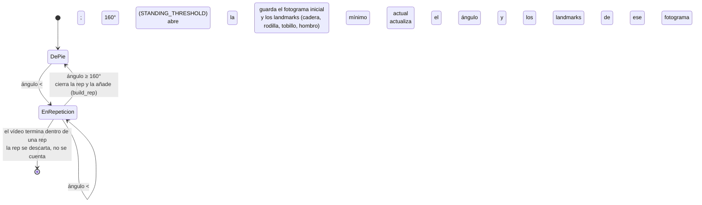

# 6. Implementación

> Fuente: `docs/superpowers/specs/2026-08-28-memoria-cap6-implementacion-design.md` (diseño
> aprobado). Este capítulo describe **tecnologías y algoritmos**, no el código en sí (según la
> estructura de `memoria-ada-outline.md` §6). Los detalles del despliegue —aprovisionamiento de la
> máquina, CI/CD, verificación en producción— están en el §12 (Anexos), no aquí. La arquitectura,
> el diseño de clases y el diseño de persistencia se describen en el §5 y aquí solo se referencian.

## 6.1 Pipeline de análisis de movimiento (cv-service)

El análisis de la sentadilla lo desarrolla Alejandro (línea de Datos/IA) y está integrado en este
mismo repositorio como el servicio `cv-service`. El código vive en `cv-service/pipeline.py` y sus
constantes están documentadas en `cv-service/GLOSARIO.md`. Esta sección lo describe en detalle
técnico a partir de ese código.

### 6.1.1 Extracción de pose

La detección de pose usa **MediaPipe Pose** (`mp.solutions.pose`, `mediapipe==0.10.14`), un
detector **pre-entrenado y usado tal cual** —no se entrena ningún modelo propio—. Se crea una única
instancia `Pose` por trabajo, con `min_detection_confidence=0.5` y `min_tracking_confidence=0.5`.

Por cada fotograma: OpenCV (`cv2.VideoCapture`) lo lee en formato BGR, se convierte a RGB
(`cv2.cvtColor(..., COLOR_BGR2RGB)`) y se pasa a `pose.process(...)`. Los fotogramas en los que
MediaPipe no detecta a ninguna persona simplemente se saltan: no se cuentan ni se les dibuja
esqueleto. Si **ningún** fotograma del vídeo produce una pose, el trabajo termina en fallo con el
código `no_pose_detected` (excepción `NoPoseDetectedError`).

De todos los puntos que devuelve MediaPipe se usan **solo cuatro**, todos del lado derecho del
cuerpo: cadera (`RIGHT_HIP`), rodilla (`RIGHT_KNEE`), tobillo (`RIGHT_ANKLE`) y hombro
(`RIGHT_SHOULDER`). Las coordenadas, que MediaPipe entrega normalizadas a [0, 1], se
des-normalizan a píxeles multiplicándolas por el ancho y el alto del fotograma.

Esto codifica una **suposición explícita del pipeline: una sola cámara lateral (plano sagital)**,
con el lado derecho del atleta hacia ella. Es la misma suposición que hace que el valgo de rodilla
(`knee_valgus`, un defecto del plano frontal) sea indetectable **por diseño**, no por falta de
implementación (§4 CU-5, §5).

### 6.1.2 Ángulo de rodilla

El ángulo de rodilla es el ángulo interior con vértice en `b` de los tres puntos `a-b-c` =
(cadera, rodilla, tobillo):

$$\theta = \arccos\!\left(\frac{\vec{ba}\cdot\vec{bc}}{\lVert\vec{ba}\rVert\,\lVert\vec{bc}\rVert}\right)$$

Se calcula en coordenadas 2D de imagen (`calculate_angle`), acotando el argumento a $[-1, 1]$ antes
de `arccos` para absorber el error de redondeo en coma flotante, y el resultado se pasa a grados.

Conviene fijar la **convención**: este ángulo interior cadera-rodilla-tobillo vale ~180° con la
pierna extendida (de pie) y **disminuye** a medida que la rodilla se flexiona. Es, por tanto,
aproximadamente el *complementario* del "ángulo de flexión" que se usa en la literatura de
biomecánica (que mide desde la extensión completa): ~90° de flexión de rodilla equivalen aquí a un
ángulo interior de ~90–100°. Esta convención es la que hay que tener presente al leer los umbrales
de §6.1.4.

La **inclinación del torso** (`torso_lean_from_vertical`) es el ángulo entre el vector
cadera→hombro y la vertical de la imagen; 0° = torso perfectamente erguido. Se implementa reusando
`calculate_angle` con un punto sintético justo encima de la cadera, en vez de repetir el cálculo a
mano. Es **solo la magnitud** de la inclinación —no distingue adelante de atrás—; esa distinción la
resuelve `is_excessive_forward_lean` (§6.1.4). Solo se usa ahí.

### 6.1.3 Segmentación en repeticiones

La secuencia de ángulos de rodilla fotograma a fotograma se agrupa en repeticiones completas con
una **máquina de estados** sencilla (`segment_reps`). En el código son dos estados: *de pie* y
*dentro de una repetición* (la variable pasa a `"descending"` al abrir la rep y no vuelve a
cambiar hasta cerrarla).

- El umbral `STANDING_THRESHOLD = 160°` separa "de pie" de "en movimiento".
- Mientras dura la repetición se guarda el **ángulo mínimo** alcanzado y las coordenadas de los
  cuatro landmarks *en ese fotograma concreto* —se necesitan para evaluar `excessive_forward_lean`
  justo en el punto más bajo de la sentadilla, no en un fotograma cualquiera (§6.1.4)—.
- Una repetición que empieza pero nunca vuelve a "de pie" (vídeo cortado a mitad de rep) se
  **descarta**, no se cuenta.

Los fotogramas por segundo (`fps`) se leen de OpenCV (`CAP_PROP_FPS`, con 30 por defecto si el
contenedor no lo informa); los tiempos de inicio y fin de cada repetición son `nº de fotograma /
fps`, redondeados a dos decimales.

### 6.1.4 Puntuación y errores de forma

La puntuación **por repetición** (`score_from_angle`) es una curva **de un solo lado**: penaliza
quedarse corto de profundidad, nunca pasarse.

$$\text{score}(a_{\min}) = \begin{cases} 100 & a_{\min} \le \text{GOOD\_DEPTH\_ANGLE\_DEG} \\[6pt] \max\!\big(0,\ \operatorname{round}\!\big(100 - (a_{\min} - \text{GOOD\_DEPTH\_ANGLE\_DEG}) \cdot \text{PENALTY\_PER\_DEGREE}\big)\big) & \text{en otro caso} \end{cases}$$

Con `GOOD_DEPTH_ANGLE_DEG = 100°` y `PENALTY_PER_DEGREE = 3`, bajar **más** del umbral (mayor
flexión, sentadilla más profunda) no resta nunca; solo resta no llegar. El razonamiento, citado en
`GLOSARIO.md`: **Schoenfeld (2010)**, *Squatting Kinematics and Kinetics and Their Application to
Exercise Performance*, y la posición de la **NSCA** (*Considerations for Squat Depth*) de que «la
evidencia científica no sostiene que la sentadilla completa exponga la rodilla a fuerzas de
compresión dañinas», en contra del mito de que «más profundo es más riesgoso». (Antes existía una
banda de dos límites, `GOOD_DEPTH_MIN`/`GOOD_DEPTH_MAX` = 70°–100°, que también penalizaba pasarse
de profundo; se colapsó a este único umbral.)

La puntuación **global** (`overall_score`) es la media de las puntuaciones por repetición,
redondeada; 0 si no se segmentó ninguna repetición.

Los **códigos de error de forma** por repetición (`build_rep`) salen del catálogo cerrado
`FormErrorCode` (`backend/app/schemas/contract.py`), que contiene exactamente `knee_valgus`,
`insufficient_depth` y `excessive_forward_lean`:

- **`insufficient_depth`** — `ángulo_mínimo > GOOD_DEPTH_ANGLE_DEG`.
- **`excessive_forward_lean`** — se evalúa en el fotograma del ángulo mínimo mediante
  `is_excessive_forward_lean(cadera, rodilla, tobillo, hombro)`, que solo marca el error si se
  cumplen **las tres** condiciones: (1) los vectores cadera→hombro y tobillo→rodilla miden al menos
  `MIN_TORSO_VECTOR_NORM_PX = 1 px` (si no, los landmarks están demasiado juntos y su dirección es
  ruido de seguimiento de sub-píxel: no se marca nada, en vez de adivinar); (2) el hombro se
  desplaza (respecto a la cadera) hacia el mismo lado horizontal en el que la rodilla queda por
  delante del tobillo —esa relación rodilla-tobillo define "adelante" de forma independiente de
  hacia dónde mire la cámara, y una inclinación hacia atrás no cuenta—; (3) la magnitud de la
  inclinación de torso (`torso_lean_from_vertical`) supera `EXCESSIVE_LEAN_DEG = 45°`. El umbral de
  45° es un **punto de partida heurístico**, no una cifra de la literatura (así lo dice
  `GLOSARIO.md`). *Historia:* la primera versión solo comprobaba la magnitud y no distinguía
  adelante de atrás, con lo que una inclinación hacia **atrás** se etiquetaba igual como
  `excessive_forward_lean`; una revisión de código lo detectó el 20/08/2026
  (`docs/2026-08-20-alejandro-cv-form-error-detection-followup-message.md`) y el commit `a5ad6b8`
  (integrado en `main` el 31/08/2026) lo hizo direccional y añadió el guardia de norma mínima.
  *Limitación documentada* (`GLOSARIO.md`, no es un bug): una sentadilla muy *hip-dominant* / de
  barra baja puede inclinar el torso hacia adelante sin que la rodilla avance sobre el tobillo —las
  dos señales no coinciden y el error no se marca aunque visualmente la inclinación sea excesiva—.
- **`knee_valgus`** — está en el catálogo y en el mapa de etiquetas del frontend
  (`frontend/src/lib/form-error-messages.ts`), pero **no se evalúa, por diseño**: es un defecto del
  plano frontal y el pipeline asume una única cámara lateral (§4 CU-5, §5). Nunca se añade a
  `errors`: no hay lógica que lo evalúe.

| Constante | Valor | Papel | Fuente |
|---|---|---|---|
| `STANDING_THRESHOLD` | 160° | Ángulo de rodilla por encima del cual se considera "de pie" (abre/cierra rep). | Heurística |
| `GOOD_DEPTH_ANGLE_DEG` | 100° | Umbral de "buena profundidad": por debajo o igual no se penaliza ni se marca `insufficient_depth`. | Schoenfeld 2010 / NSCA |
| `PENALTY_PER_DEGREE` | 3 | Puntos restados por cada grado por encima de `GOOD_DEPTH_ANGLE_DEG`. | Heurística |
| `EXCESSIVE_LEAN_DEG` | 45° | Magnitud de inclinación de torso por encima de la cual se marca `excessive_forward_lean`. | Punto de partida heurístico |
| `MIN_TORSO_VECTOR_NORM_PX` | 1.0 | Norma mínima (px) de un vector de landmarks para fiarse de su dirección. | Guardia de ruido de seguimiento |
| `ANNOTATED_VIDEO_FOURCC` | `avc1` | Códec del vídeo anotado (H.264). | Compatibilidad con `<video>` (§6.1.5) |

### 6.1.5 Vídeo anotado

En cada fotograma con pose detectada se dibuja el esqueleto (`mp_drawing.draw_landmarks` con
`POSE_CONNECTIONS`) y el ángulo de rodilla entero como texto junto a la rodilla (`cv2.putText`,
`"<n> deg"`). **Todos** los fotogramas —anotados o no— se escriben al vídeo de salida
(`writer.write(frame)`).

El códec es `ANNOTATED_VIDEO_FOURCC = cv2.VideoWriter_fourcc(*"avc1")`. Merece explicar **por qué
no es el `mp4v` obvio**: el elemento `<video>` de los navegadores solo decodifica H.264/AVC,
VP8/VP9 o AV1, no MPEG-4 Part 2, así que un archivo `mp4v` se reproduce como un fotograma en blanco
en la página de resultados. `avc1` produce H.264 real con este build de OpenCV, sin necesitar un
post-proceso con `ffmpeg`. Fue un bug real, detectado la primera vez que se reprodujo en un
navegador un vídeo del pipeline **real** (no del falso) — commit `eeae94a`, *"encode annotated
video as H.264, not MPEG-4 Part 2"* (véase también la fase correspondiente del §3).

### 6.1.6 Naturaleza del pipeline

MediaPipe Pose es un detector pre-entrenado usado tal cual; **todo lo que hay aguas abajo**
—ángulos, máquina de estados, umbrales, puntuación— son **reglas deterministas**, ajustadas por
constantes, no aprendidas. No hay conjunto de entrenamiento ni cifra de *accuracy* / *precision* /
*recall*: la pregunta de fiabilidad que sí tiene sentido (contar bien las repeticiones sobre vídeo
real) se plantea en §4 (RNF-4) y se evalúa en §7. El campo `algorithm_version` del resultado es la
cadena literal `"squat-rules-v1"` y `exercise_type` es `"squat"`.
